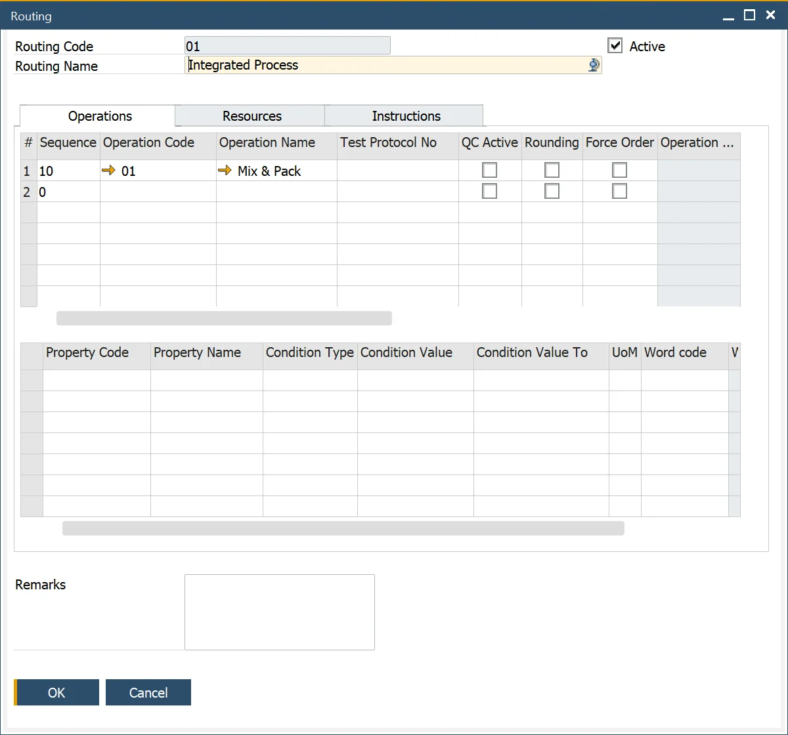

# Routing

Routing consists of Operations and Resources. You can set the required values for both of them.

You can define Multiple Routings for a product, but you have to set one of them as a default in the related Bill of Material.

Routes may be active or non-active by checking the active checkbox within the form header.

Routings are an optional function to be used in conjunction with Bills of Materials and Manufacturing Orders.

---

:::info Path
    Production → Routings → Routing
:::

## Adding and Changing Operation data

The top grid within this tab allows the user to select, add and remove operations.

The user can also define the operation which overlays or operates parallelly to the base one and specify the overlay percentage.

This data will be used for scheduling purposes.

## Operation Properties

Data is presented to the user within the grid when the user selects the row within the top grid.

The properties of the selected operation are filled in by default in this tab.

This grid allows the user to select and add additional properties for this operation/routing combination and change or remove the default values.

## Adding and Changing Resource data

The top grid within this tab allows the user to select, add and remove resources.

Drop-down box selection allows the user to choose the resource already defined on the operation.

The details of the selected resources are filled in by default in this tab from the Operations definition.

This grid allows the user to select and add additional resources for this operation/routing combination and remove the defaulted resources.

The fixed and variable time elements values and unit of rates of the selected resource/operation are filled in by default in this tab.

The user can change these default values if required for this specific route/operation/resource combination.

The yellow arrow navigation to:

Production → Technology → Resources → Resources

## Resource Properties

Data is presented to the user within the grid when the user selects the row within the top grid.

The properties of the selected resource/operation are set by default in this grid based on the Resource definition.

This grid allows the user to select and add additional properties for this resource/operation/routing combination and change or remove the default values.

## Instructions tab

This tab contains an editable text area that can hold related text information, e.g., instructions and additional notes.
