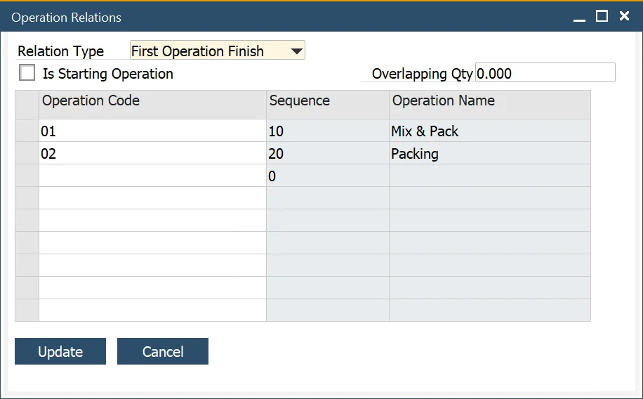

# Advanced Operation Relations

In previous versions, it was possible to set up Operations in a consecutive sequence only. This option allows the setup of more complicated Operation relations.

---

You can reach the option by right-clicking on Operation in the following locations:

:::note Path

- Production → Routing → Routings → Operations tab

- Production → Manufacturing Order → Manufacturing Order → Operations tab

- Production → Bill of Materials → Production Process → Routings tab → Routings tab

:::

## Operation Relations

Example Routing:

Standard sequence:

Available options:

**Relation Type**:

- None – the option not used

- First Operation Finish – a specified operation starts when the first chosen on Relation Operation form Operation is finished.

Example:
Settings for Operation 04:

Result: Operation 04 starts when Operation 01 is finished

- Last Operation Finish – a specified operation starts when the last of the chosen Relation Operation form Operation is finished

Result: Operation 04 starts when Operation 02 is finished.

**Is Starting Operation** – choosing this option for a specific Operation makes it start operation. This creates two parallel sequences.
Example: for Operation 03 Is Starting Operation checkbox is checked:

Example:
for Operation 03 Is Starting Operation checkbox is checked:

**Overloading** – a specified Operation starts when the chosen on Operation Relation form Operation produces a specified quantity

### Advance Operation Relations Indicator

You can check if Operations has advanced relations assigned by checking the values in the following columns:

Advance Relation Types:

- SO – Is Starting Operation

- FF – First Operation Finish

- LF – Last Operation Finish

### Operation Relation Map

By visualizing Operations connections, you can check the overall sequence (and all its advanced operations relations).

You can reach the option by right-clicking on Routing in the following locations:

:::info Path
Production → Manufacturing Order → Manufacturing Orders → Operations tab → Operations tab

    Production → Bill of Materials → Production Process → Routings tab → Routings tab

:::

Example Operations relations chart:

