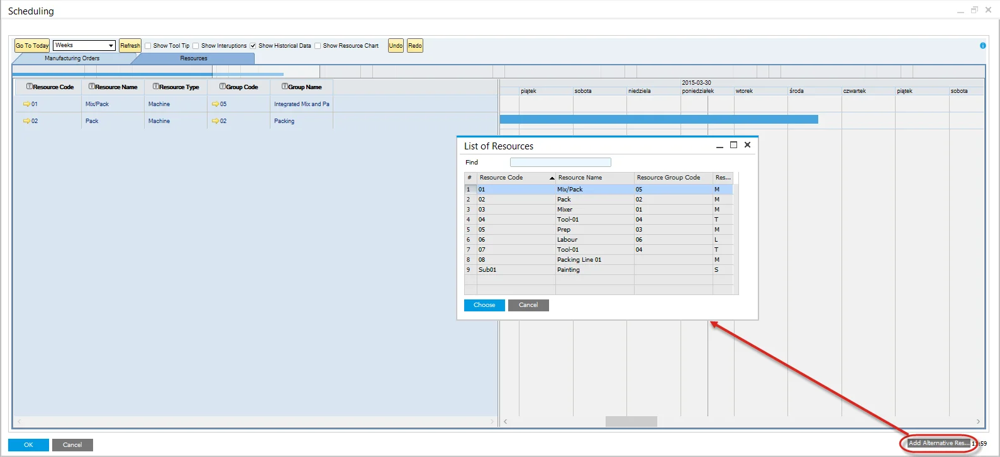

# Alternative Resources

In this section, you can check how to set Alternative Resources.

---

## Alternative Resources Master Data

Within the Production Process form > Routings tab, define Resources assigned to a specific Operation:

Checking Is Default checkbox causes the chosen Resources to be displayed in the corresponding table on Manufacturing Order.

## Manufacturing Order

The default Resource is displayed within the Resource Grid of the Operations Tab. (It is possible to define more than one default Resource).

Click Choose From List button to open the list of alternative resources previously defined in a corresponding Production Process.

## Selecting Alternative Resources

- Press the "Add Alternative Resources" button to open the List of Resources table.
- Select the required Resources.
- Press "Choose."

    
- The select resources are now displayed within the Resources Tab of the Gantt.

    

## Highlighting the Alternative

- Hover the mouse over the resource block to be moved.
- A dotted area under the resource block will indicate there are alternative resources.
- Left mouse click and hold on the dotted area.
- Gray vertical lines will highlight the alternative resources.

    

## Moving to the Alternative

- Continue to Press the right mouse button.
- Drag the resource block to the required alternative.
- A red block will display, representing the new time.
- Drop, Un-Press the right mouse button.

    
- The resource block is now placed on the alternative.

    
- To view these resources alternative, use the same navigation as above.

## Manufacturing Order Changes

- The update function saves the Gantt changes.
- Changes the planned resource to the alternative resource (actual).
- Automatically recalculates the lead time and the start date.

## CompuTec PDC

You can also switch a Task to an Alternative Resource from the CompuTec PDC level.
