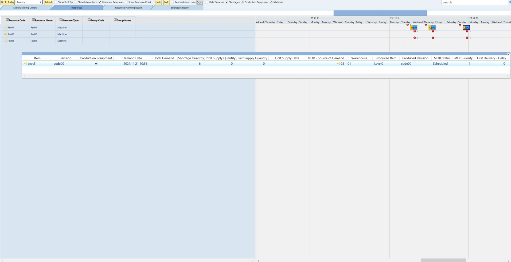
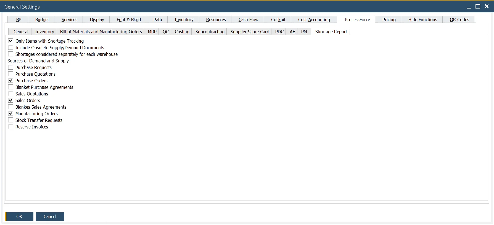

# Material Shortage

This functionality aims to:

- plan Tools within the Gantt chart,
- trace Tools and material shortages (defined as traced) within the Gantt chart, along with information about the planned supply (first delivery),
- trace Tools and material shortages (defined as traced) in the Tools/materials shortages report and information about all the planned supplies.

---

## The Gantt chart functionality

### Configuration

#### Item Master Data

There are two related checkboxes in the Item Master Data form:

**Production Equipment** (tool, set) – items on the Gantt chart can be filtered according to this qualification. If this checkbox is selected by default, the Shortages Tracking checkbox is selected automatically.

**Shortages Tracking** – if checked, the given item will be calculated in the shortage report and filtered on Gantt according to this qualification.

## Usage

Check the Shortages checkbox in the header of the Gantt chart.

The user can decide whether to view Production Equipment Materials shortages or both. Manufacturing Orders with shortages are marked with a red line at the bottom of the Gantt Chart. A floating panel with a list of deficiencies also appears. This floating panel is updated as changes are made to the Gantt Chart.

1. The floating Panel is visible if the Shortages checkbox is checked:

    1. By default, the Production Equipment and Materials checkboxes are selected. In the Floating Panel, all shortage items for all Manufacturing Orders are visible with a shortage marker according to the setting in General Settings (Only Items with Shortages Tracking).
    2. If the Production Equipment checkbox is not checked and Materials is selected, Production Equipment is not visible in Floating Panel.
    3. If the Production Equipment checkbox is selected and Materials is not selected, only Production Equipment is visible in Floating Panel.
    4. Always one of them (Production Equipment or Materials) has to be selected.
2. Upon start, Floating Panel contains information for all Manufacturing Orders with shortage marker. Users can select a particular Manufacturing Order on Gantt; then, the floating panel is constrained to the specified Manufacturing Order.
3. The Floating panel is dynamic – changes on Gantt are on the fly and considered in the panel calculations.

## Shortages Report

### Configuration

**Only Item with Shortage Tracking** – determines whether in the Gantt and the shortage report all Items are visible or only those marked as Shortages Tracking in Item Master Data.

**Include Obsolete Supply/Demand Documents** – determines whether available quantities (supply, demand) from documents with Delivery Date equal or earlier than the current date are considered for calculating Opening Balance Quantity in the Shortage Report.

**Shortage considered separately for each warehouse** determines whether Demands and Supplies with the same Warehouse defined for the Item which is the shortage (Manufacturing Order, the Items tab) or all Warehouses are considered during the report calculation.

### Usage

The Gantt Chart also has a new tab called “Shortages Report,” which displays shortages for each Item and Revision along with historical and current supply and demand transactions. A graph also shows available quantities or scarcity of the Item/Revision.

