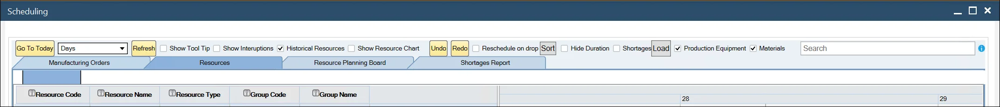
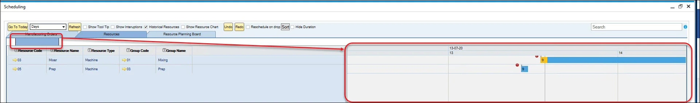
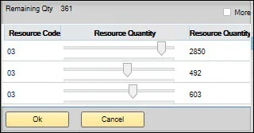

# Overview

A Gantt chart is a kind of bar chart that presents a project schedule. In ProcessForce Gantt chart is used to present and modify the production process.

Here you can find information about the options available from the Gantt chart level.

:::info
    Please remember that on the Gantt chart, it is only possible to schedule forward, not backward (forward and backward scheduling is possible in other places in ProcessForce, e.g., on Manufacturing Order).
:::

:::caution
    The Gantt Chart option can be used only when the Direct Data Access mode is enabled.
:::

:::caution
    Please note that it is required for a user to have Gantt Authorizations assigned to use this option.
    

    
Click here to find out more

    

    
     

:::

## Header

**Go to Today** – shows the current date and time.

**Days/Weeks/Months drop-down list** – a choice made here changes the scale of view, e.g., choosing Days results in displaying a day stretched across the chart.

    
Click here to expand

    

    This option allows you to change the view ratio. There are three templates:

    **Template 1:**
    | Date - Beginning of the week | 21.03.22 | | | | | | | 28.03.22 | | | | | | |
    | --- | --- | --- | --- | --- | --- | --- | --- | --- | --- | --- | --- | --- | --- | --- |
    | Day Names | Monday | Tuesday | Wednesday | Thursday | Friday | Saturday | Sunday | Monday | Tuesday | Wednesday | Thursday | Friday | Saturday | Sunday |
    
    

    **Template 2:**
    | Date - Beginning of the week | 21.03.22 | | | | | | | 28.03.22 | | | | | | |
    | --- | --- | --- | --- | --- | --- | --- | --- | --- | --- | --- | --- | --- | --- | --- |
    | Day Number | 21 | 22| 23 | 24 | 25 | 26 | 27 | 28 | 29 | 30 | 31 | 1 | 2 | 3 |

    
    
    **Template 3:**
    | Date - Each Day | 21.03.22 | | | | | | | | | | | | | | | | | | | | | | | | 22.03.22 | | | | | | | | | | | | | | | | | | | | | | | | 
    | --- | --- | --- | --- | --- | --- | --- | --- | --- | --- | --- | --- | --- | --- | --- | --- | --- | --- | --- | --- | --- | --- | --- | --- | --- | --- | --- | --- | --- | --- | --- | --- | --- | --- | --- | --- | --- | --- | --- | --- | --- | --- | --- | --- | --- | --- | --- | --- | --- |
    | Hours | 0 | 1 | 2 | 3 | 4 | 5 | 6 | 7 | 8 | 9 | 10 | 11 | 12 | 13 | 14 | 15 | 16 | 17 | 18 | 19 | 20 | 21 | 22 | 23 | 0 | 1 | 2 | 3 | 4 | 5 | 6 | 7 | 8 | 9 | 10 | 11 | 12 | 13 | 14 | 15 | 16 | 17 | 18 | 19 | 20 | 21 | 22 | 23 |

    

    The above templates can be switched based on the user's user adjustment in the Day/Week/Month option or manually by extending or cutting the scroll bar.

    **By Day/Week/Month Option**:
    

    **By Manually**:
    
    

You can set a default value for every Gantt chart opening in [General Settings](/docs/processforce/user-guide/system-initialzation/general-settings/general-tab/).

**Refresh** – updates the view.

**Show tool Tip checkbox** – shows Task details; tick the checkbox and click on any Operation on the chart.

    
Click here to expand

    

    
    

**Show Interruptions** – shows breaks in production based on [Resource Calendar](/docs/processforce/user-guide/scheduling/resource-calendar/).

    
Click here to expand

    

    
    

**Historical resources** – show historical data.

**Show Resource Chart** – shows the use of Resources or a Resource Group over a selected period. Click [here](/docs/processforce/user-guide/scheduling/gantt-chart/show-resources-chart/) to find out more.

    
Click here to expand

    

    
    

**Undo/Redo** – moves to previous/next step.

**Reschedule on the drop** – automatically reschedules on a drag & drop action without clicking the Update button.

**Sort** – sets a queue for Manufacturing Orders based on defined parameters (this is Resource Planning Board tab related option. Click [here](/docs/processforce/user-guide/scheduling/gantt-chart/resource-planning-board/) to find out more).

    
Click here to expand

    

    
    

**Hide Duration** – it hides duration on Manufacturing Order rows in Resource Planning Board.

    
Click here to find out more

    

    
    

**Shortages, Production Equipment, Materials** – Material Shortages report related options. Click [here](/docs/processforce/user-guide/scheduling/gantt-chart/material-shortage/) to find out more.

## Tabs

### Manufacturing Orders

Displays a view of the realization of Manufacturing Orders in time.

It is possible to expand Manufacturing Orders to check all their Operations and to expand Operations to check all their Resources.

### Resources

Presents a view of the execution of Manufacturing Orders broken down into resources.

**Slider** – on the top of a Gantt chart, there is a bar representing a specific period with activities displayed. The slider is the highlighted part of the bar. Moving it over the bar (by left-clicking and dragging it) displays different parts of a Gantt chart in a main tab:

You can expand or shrink the slider by clicking, holding, and moving its left or right edge. This will affect the range of the Gantt chart part displayed in the main tab.

**Columns filtering** – click one of the icons next to each of the column headers to filter rows in this column:

**Find related Manufacturing Order** – right-click on a Resource row, choose Show on Chart, and then the required Manufacturing Order number. Now the chart will move to the beginning of the pointed Manufacturing Order.

**Colors of a Taskbar**:

- grey – Queue Time,
- yellow – Setup Time,
- blue – Run Time,
- green – Stock Time.

**Red exclamation mark** – red exclamation mark means that the marked Manufacturing Order will not be completed on the Required Date.

**Resource context menu** – right-click on a Taskbar to get more options:

- Reschedule – allows rescheduling the Task to another Resource. Rescheduling requires an adequately configured Production Process. Define the Resource and its Alternative. Click here to check how to do this.

- Divide – you can set to use more Resources to complete a Task.

    Choosing the option leads to a new form. Right-click on a Resource row and click Add Resource:

    

    Use sliders to set the quantity for each of the Resources:

    

    :::caution
        Please remember that the remaining quantity must be 0 (all sliders on the far right position) to proceed with the division.
    :::

- Extend work – this option allows adding to a Task additional Run Time based on the Exceptions tab in the [Resource Calendar](/docs/processforce/user-guide/scheduling/resource-calendar/) form, e.g., if a Resource is set to be available every Monday to Friday, 7:00 AM - 4:00 PM and based on this Task performed on the Resource finishes on Monday 9:00 AM, it is possible to extend work on Friday to finish the Task (with related Resource Calendar exception set for the Friday, 4:00 PM - 6:00 PM)

- Freeze – blocks this Task scheduling (on a Resource assigned to a specific Manufacturing Order). When you use Freeze for a Task, its time constraints stay the same, even when the whole Manufacturing Order is rescheduled to some other time.

R6: Freeze a Resource from a Manufacturing order level

:::info
Since ProcessForce 10.0 R6 version, it is possible to freeze a specific Resource from the Manufacturing Order level
:::

:::info Path
Production → Manufacturing Order → Manufacturing Order
:::

- Lock – works the same way as the Freeze option but affects a whole Manufacturing Order, all related Tasks (instead of just one Task)

### Resource Planning Board

Click [here](/docs/processforce/user-guide/scheduling/gantt-chart/resource-planning-board/) to find out more.
