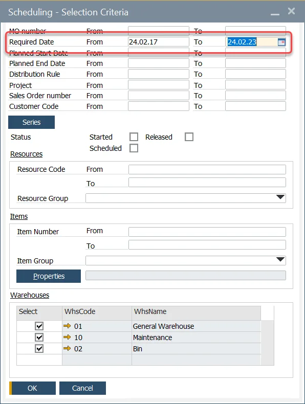

# Selecting Manufacturing Orders

You can use the extended filter option to quickly pick Manufacturing Orders which will be presented on the Gantt chart.

---

## Selecting Manufacturing Orders

There are multiple methods in selecting orders; in this example, it is by Required Date "From," "To."

You can also choose Manufacturing Orders by Status, used Resources, Manufacturing Order Item, and Warehouse. You can also mix the criteria.

## Deselecting Manufacturing Orders

All Manufacturing Orders are automatically selected.

To deselect a specific order, uncheck the line.

To deselect all the orders, click on the column heading "Show in Gantt."

Press the Select button to display these orders within the Gantt display.

Clicking the arrow down on the Select button allows you to go to Scheduling Board.
