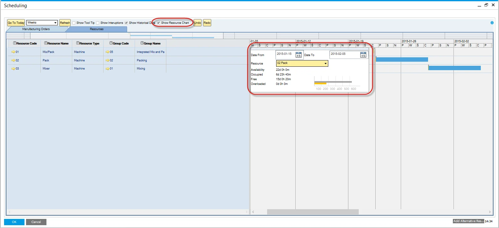
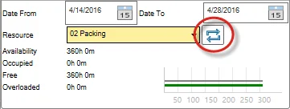
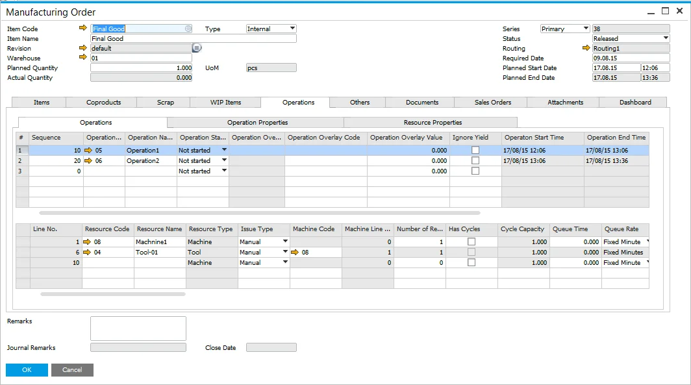
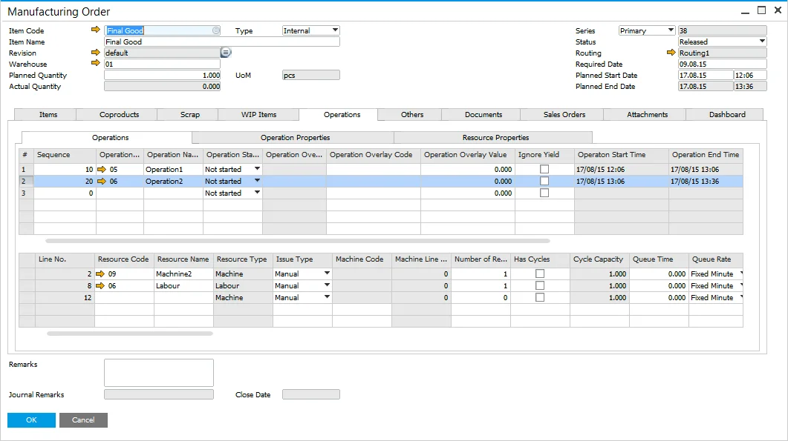
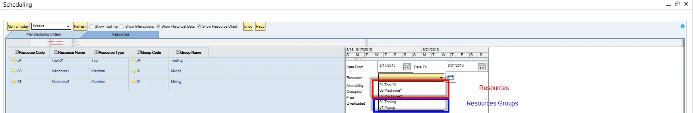
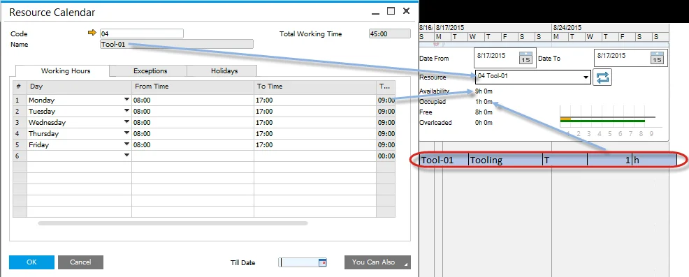
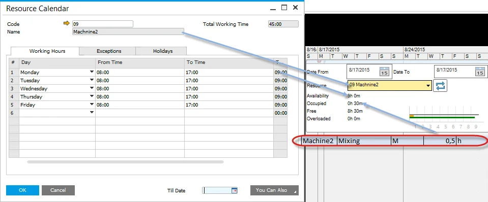
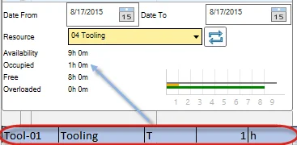
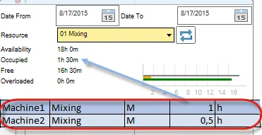

# Show Resources Chart

If the Show Resource Chart checkbox is checked, a form with Resource Chart is displayed.

## Resource Chart

Chart communicates four different kinds of time for a specific resource or a group of resources:

- Availability – data displayed here is taken from Resource Calendar. It consists of Occupied and Free time.
- Occupied – is calculated from all Manufacturing Orders assigned to a specific resource in a required period.
- Free – Availability minus Occupied time. A value that describes a time when a resource is not working and is free to use.
- Overloaded – value is displayed here when the Occupied value exceeds Availability. In this situation, a value displayed here shows the amount of time over Availability time.

After setting the required time constraints (in the example screenshot, the period starts on 2015-01-15 and ends on 2015-02-05) and a resource chart will be filled with data:

- a value of time next to each of the time kinds described above
- a graphic representation of those values – which allows fast comparison of different times.

Within the Chart, data for a specific resource or a group of resources can be displayed.

The dynamic chart changes automatically after changing data displayed, e.g., by changing graphic representations on Gantt Chart.

### Refresh button

The capacity graphs displayed in the Gantt chart are based on the Manufacturing Orders selected and loaded into the form. The user can choose a subset of Orders in the Manufacturing Order selection screen. Therefore to get an accurate picture of the resource capacity, to include all selected and non-selected Orders, pressing the refresh button will calculate the actual capacity situation.

## Example

The following example helps to understand the data displayed on the resource chart and where it was taken.

The screenshots below present Manufacturing Orders used on the chart:

Resources used on those Manufacturing Orders are:

|            | Resources | Resource Group | Type | Run time | UoM |
| :--------: | :-------: | :------------: | :--: | :------: | :-: |
| Operation1 | Machine1  |     Mixing     |  M   |    1     |  h  |
|            |  Tool-01  |    Tooling     |  T   |    1     |  h  |
| Operation2 | Machine2  |     Mixing     |  M   |   0,5    |  h  |
|            |   Labor   |    Tooling     |  L   |   0,5    |  h  |

Resources and resources groups are available on the chart from the drop-down list:

### Resource

The following screenshots present a resource chart with a specific resource chosen. Note that labor is not taken into calculation account:

Tool-01:

Machine1:

Machine2:

### Resource Group

The following screenshots present a resource chart with a specific resource group chosen. When a resource group is selected, a combined time of every element in a group is displayed. Note that labor is not taken into calculation account:

Tooling:

Mixing:

