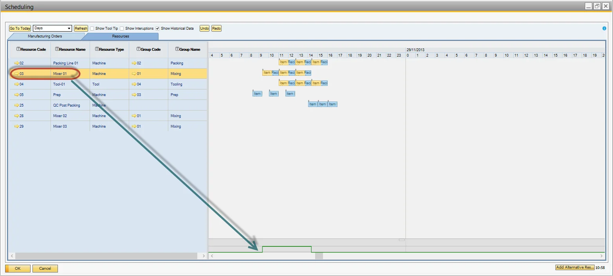
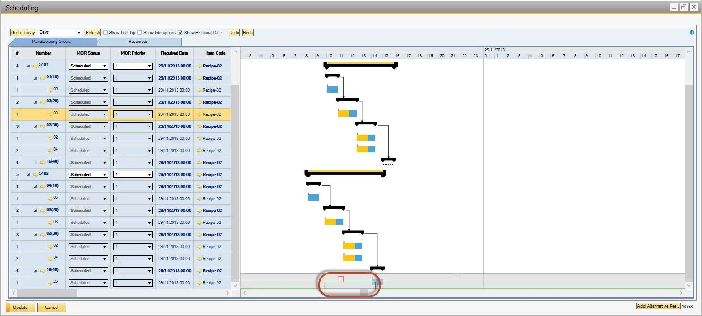

# View Planned Resource Capacity

Here you can check how to check Resource capacity.

---

## Resources Tab

- Click on the row of the resource to view.

- The bottom of the Gantt chart displays the consumed capacity.

- Drag a resource block to a different period.

- Capacity is auto-calculated and displays overload.

## Manufacturing Orders Tab

Using the same navigation as above.

