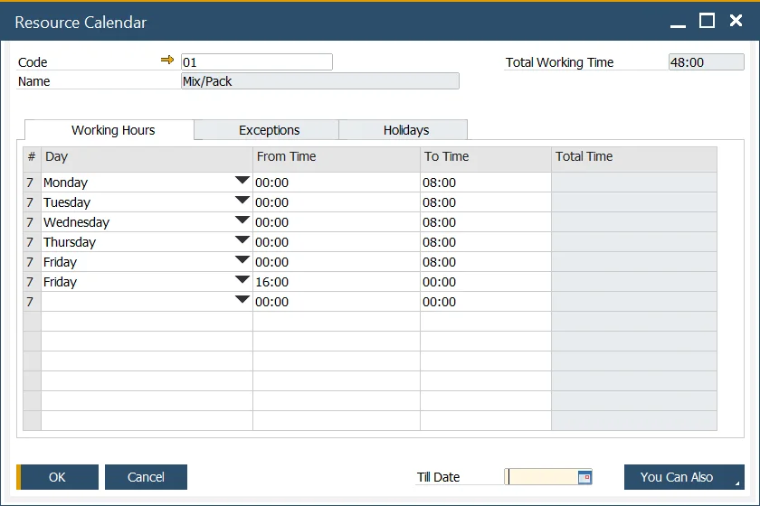
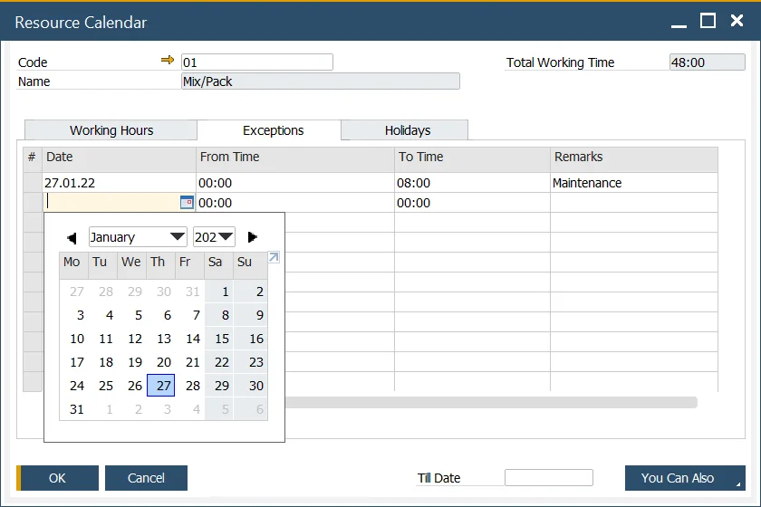

# Resource Calendar

Resource Calendar allows planning week capacity of a specific resource, exceptions (additional capacity), and holidays (time-off for a particular period). A Resource Calendar can be created manually or by assigning a predefined Calendar Template.

---

:::info Path
    Production → Routings → Resource Calendar
:::

## Resource Calendars

Resource Calendar is created automatically when a Resource is added.

You can access Resource Calendar by the path above or by clicking a yellow arrow next to the Resource Calendar field.

## Resource Calendar tabs

### Working Hours

In this tab, you can define working hours for a specific resource for every day of the week (you can specify many separate periods for each day). After setting From Time and To Time, Total Time is calculated automatically. In the Total Working Time field, a total of set hours for a whole week is displayed.

### Exceptions

The exception is additional work/capacity. It extends the Resource's abilities. You can use this for overwork scenarios to increase capacity.

The date and time can be defined along with Remarks describing an exception reason.

By clicking the, You Can Also button and the Remove past exceptions option; you can delete previously set Exceptions.

Click the You Can Also button and Create exceptions based on current working days till... you can fill the Exceptions list with work days (and set hours) until the date specified in the Till Date field.

### Holidays

Here you can define one-day time-offs and Remarks connected to them.

By clicking the You Can Also button and then Copying a list of Holidays defined in the system, you can automatically fill in the Holidays list with predefined data.

The Holiday dates assign to a company are available in the following main menu path: Administration, System Initialization, Company Details, Accounting tab, Holidays. From there, you can also define a new set of dates, available later to assign. It is SAP Business One function.

## Resource Calendar Update Tool

:::info Path
    Production → Routings → Calendar Updates
:::

You can assign a predefined Resource Calendar Template to a specific Resource, loading the related Resource Calendar with the data from the template. You can set a template to many Resource Calendars at once.

### Resource Calendar Template

:::info Path
    Administration → Setup → Production → Resource Calendar Template
:::

You can create a Resource Calendar Template that can later be assigned to a specific Resource. Fill in the required fields (like when creating a Resource Calendar) and click the Add button.

### Update

Choose a predefined Resource Calendar Template in the header of the form and define a list of Resource Calendars that you want to update with the data from the template:

