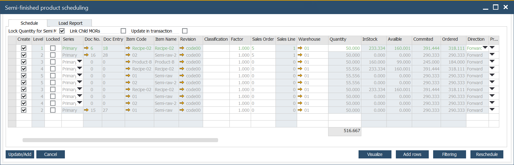
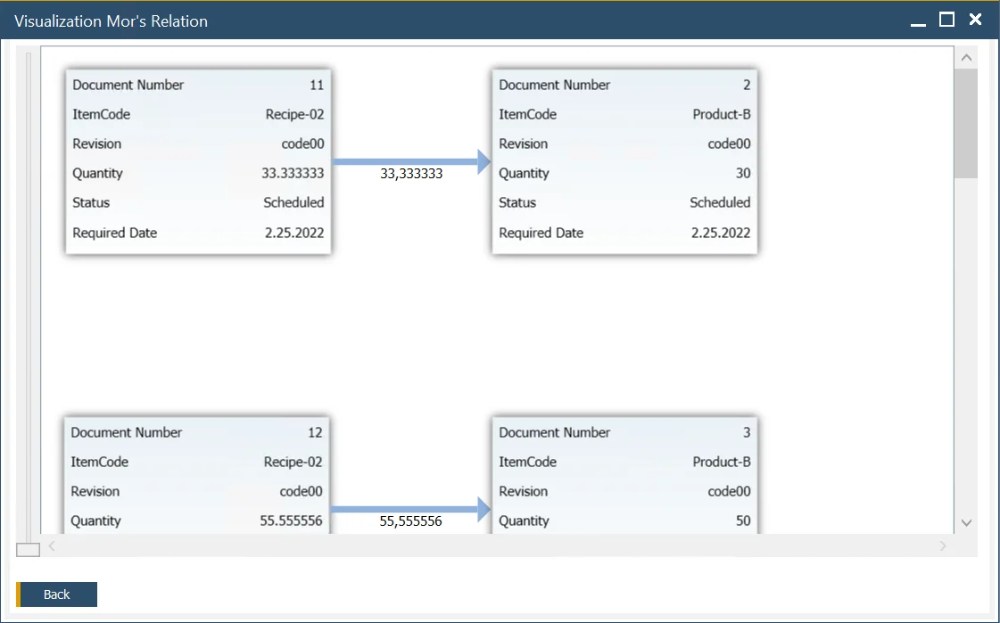

# Scheduling Board

Scheduling Board is a production planning tool that allows scheduling (and rescheduling) several Manufacturing orders (filtered by chosen criteria) quickly. It also allows managing Manufacturing Orders based on a multi-level Bill of Materials, considering the product structure. Due to the usage of product planning-relate-dated dates and times, the system can communicate situations when it is impossible to process a Manufacturing Order on time for the planned Delivery Date and suggest the first date available to do this.

---

## How to open Scheduling Board / Semi-finished Product Scheduling

This option is available from the following place in the system:

### Scheduling

:::info
    Production → Manufacturing Order → Scheduling
:::

From here, choosing a single Manufacturing Order or a bigger number is possible.

You can select/deselect all the Warehouses by double-clicking on the top of the Select column.

Use Scheduling Selection Criteria to choose information about which Manufacturing Orders are to be displayed and click OK (if no criteria are determined, all of the Manufacturing Orders in the system are preferred). This leads you to a list of selected Manufacturing Orders. Choose the Scheduling Board option from the Select button:

### Sales Order

:::info
    Sales A/R → Sales Order
:::

It is possible to create semi-finished Items Manufacturing Orders from a Sales Order context menu by choosing to Create Manufacturing Orders:

Note that there are two similar options:

- Create Manufacturing Orders – leads to Scheduling Board,
- Create Manufacturing Order – creates a single Manufacturing Order (for the Item from Content tab, clicking on which leads to open the context menu).

### Manufacturing Order

You can create semi-finished products from a context menu of a final good Manufacturing Order:

After creating semi-finished product Manufacturing Orders here, another option is available from the context menu: Scheduling → Recalculate Semi-finished Products Lead Time. This option also leads to Semi-finished Product Scheduling Board and allows changing the Manufacturing Order dates and recalculating the Lead Time.

### Order Recommendation

:::info Path
    MRP → Order Recommendation
:::

You can also reach the for from the Order Recommendation form:

## Scheduling Board / Semi-finished Product Scheduling

Semi-finished product scheduling is a tool for production planning, considering a product structure.

### Schedule tab

#### Create

This checkbox determines whether a Manufacturing Order for this Item will be scheduled to be created.

:::caution
    The checkbox cannot be checked if a higher-level item is disabled.
:::

#### Level

Levels in a production tree. If a Manufacturing Order has Semi-finished Items, a position in the structure will be indicated here. Click [here](/docs/processforce/user-guide/formulations-and-bill-of-materials/bill-of-materials/multi-level-bill-of-materials/semi-finished-items/) to find out more.

#### Quantity

The number of planned items. Only item quantity on level 1 can be changed. Quantity on lower levels changes automatically after that.

#### Lock Quantity for Semi MORs

If the checkbox is checked, there is the possibility to change the quantity for a particular item. In this case, changing one thing does not affect other items.

#### Update in Transaction

The listed Manufacturing Orders will be added when you click Update/Add on the Scheduling board. Some of the Manufacturing Orders will not be added because of some errors (synchronization errors, incorrect data set in Manufacturing Orders, etc. – in these cases, an error message is displayed).

**The checkbox is checked**: none of them will be added if there is at least one Manufacturing Order with an error.

**The checkbox is not checked**: if there are Manufacturing Orders with errors, the correct ones will be added anyway (and the ones with mistakes not).

#### Direction

Production can be planned in two ways:

- Forward - the system automatically plans forward the start and end of the day, absolute time, and required date.
- Backward - the system automatically plans backward start and end day, absolute time, and required date. Sometimes it is impossible to make items to the required delivery date. The text on the scheduling board is red.

#### Priority

Priority of commission.

#### Schedule Date and Time

#### Date and Time of end of the order

#### Routing

Available routing can be chosen from the Scheduling Board.

#### Filtering option

The option allows filtering Manufacturing Orders based on the standard SAP Business One option.

#### Visualize

Clicking this option opens a visual representation of relations between Manufacturing Orders:

#### Copy row, Copy multiple rows

You can copy a row or multiple rows. The option is available from the context menu in the first column.

To use Copy multiple rows option, highlight more than one row (by using Shift+left click or Ctrl+left click) and right-click on <u>any column apart from the first one</u> to reach the option (otherwise, the highlight is lost).

### Load report tab

This tab summarizes Set Up Time, Run Time Machine, and Labor type Resources for a specific period.

Load Report considers all data calculated in the Schedule tab (even before saving/creating documents from the Schedule tab).

Values in the time columns (proper from the Resource Type column), e.g., 1:25 / 168:00, shows aggregated already scheduled time and total availability calculated based on a related Resource Calendar.

Filtering options:

- **MO number** – Manufacturing Orders to consider
- **Item** – Final Good Items to consider
- **Resource** – Resources that are used in Manufacturing Orders
- **Resource Group** – filters Manufacturing Orders where at least one Resource from the selected group is used
- **Planned Start, Planned End, Required Date** – Manufacturing Order dates
- **Released, Scheduled, Started** – Manufacturing Order statuses
- **Periods** - aggregate data either in days, weeks, or months (in the columns right from the Resource Type column)
- **By Resource/ By Group** - displays either a list of Resources (the screenshot above) or Resources grouped by the Resource Group, with a total for each group:

## Example

Create a Sales Order and determine its Delivery date (in its header).

:::info Path
    Sales A/R > Sales Order
:::

To check the possibilities to produce the Item, right-click on it and choose to Create Manufacturing Orders.

The system always considers the Delivery Date, Internal Lead Time, and plans Start Date backward. If Start Date is earlier than today, it changes direction to Forward and plans the earliest possible End Date.

Let's consider two possibilities - `Delivery date is possible to realize it` and `Delivery date is not possible to realize`:

1. Delivery date is possible to realize it.

    The delivery date is copied to Scheduling Board. It is checked if it is possible to make this Item on time.

    

    In this screenshot, we can see that to meet the need for delivery on 30.11.17, 0:00; the production has to be finished on 28.11.17, 12:00. Green row indicates that it is possible. The Manufacturing Orders can be scheduled to be delivered on time.
2. Delivery date is not possible to realize.

    In the second option, you would like to check if it is possible to produce this item today.

    

    On the screen, you can see it is impossible (the row's red color communicates it). The system automatically changed direction to Forward and set to the earliest possible End Date for 08.06 00:00. Now we can change this date to 20.09 at 00:01, direction Backward, and click Reschedule. Now the row is green again, indicating that it is possible to schedule it this way.

## Sales Order Minimum Order quantity

This option allows considering Sales Order options (Minimum and Maximum Quantity, Order Multiple) when creating Semi Finished Manufacturing Orders suggestions on Scheduling Board. This gives the sales operator a tool to provide an accurate estimated arrival time.
