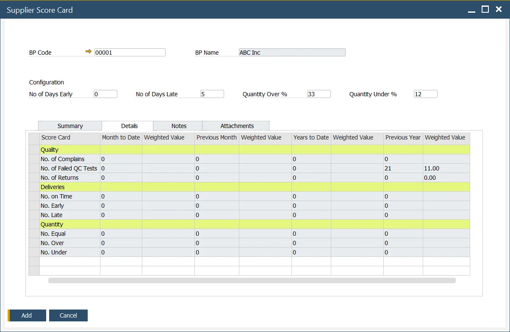

# Supplier Score Card

ProcessForce Supplier Score Card is a reporting function based on a weighted supplier scorecard. It helps to evaluate Suppliers' performance based on information about quality, quantity accuracy, and punctuality of deliveries.

---

:::warning
    - Delivery and Quantity calculations on Supplier Score Card are made based on Purchase Order and Goods Receipt PO documents. A specific Purchase Order and Goods Receipt PO must be linked for the function to work correctly. It can be done by creating a Goods Receipt PO by using Copy To option on a Purchase Order or connecting the Purchase Order by Copy From Option on Goods Receipt PO.
    - Dates are compared between lines of documents (not document header dates).
:::

## Settings

### General Settings

:::info Path
    Administration → System Initialization → General Settings → ProcessForce tab → Supplier Score Card tab
:::

Here you can define a number of values connected to Supplier (which have to add up to 100%), which defines a rank of specific value. These settings are created based on the weighted Supplier scorecard idea.

## Supplier Score Card

:::info Path
    - Business Partners → Supplier Score Card,
    - You can also reach the form for a specific Business Partner from the Business Partner form header context menu (available only when the BP type is set to Supplier for this Business Partner).
:::

### Header

Here you can define additional settings for a specific Supplier related to delivery and quantity.

- No of Days Early and No of Days Late define a period before and after the order date in which delivery is still acceptable,

    **Example**

      - The order date is 16.11.2016
      - No of Days Early: 2
      - No of Days Late: 2
      - Every delivery before 14.11.2016 will be deemed as early, and every delivery after 18.11.2016 will be considered late.
- Quantity Over % and Quantity Under % define a range of quantity of delivery that is still acceptable.

    **Example**

      - The ordered quantity is 100.
      - Quantity Over %: 10
      - Quantity Under %: 10
      - Everything delivery less than 90 will be deemed too small, and delivery bigger than 110 will be considered too big.

### Summary

**Weighted Values** - are defined for each weight in General Settings, e.g., No. Of Complaints, No. of Failed QC Tests, No of Returns, etc.

**Month to Date** - the total of transactions for the current month; e.g., if now is 15th October, transactions from 1st October until 15th October are considered.

Month to date relates to the weighted values calculated in the current month.

**The previous month** - the weighted values calculated in the last month.

**Year to Date** - relates to the total of each month's weighted values to the current month, e.g., January to May, where May is the current month.

**The previous year** - relates to the total of each month's weighted value for an entire 12-month period, i.e., January to December.

### Details

On this tab, three values from the Summary tab are Summary tab broken down into specific weighted scorecard positions.

All the values in the Details tab are displayed only, calculated based on specific settings and transactions, e.g., QC Tests, Returns, etc.

#### Details tab Calculation

Note Grade = Amount / Total and Weighted Score = Weight x Grade

|        Quality         |                        No of weighted                        |                                              Weighted Value                                              |
| :--------------------: | :----------------------------------------------------------: | :------------------------------------------------------------------------------------------------------: |
|   No. of Complaints    |      A = Total Number of Complaints (for this supplier)      | ( A / Total number of Complaints (for all suppliers) ) x No of Complaints (value from General Settings)  |
| No. of Failed QC Tests | B = Number of Failed Tests (QC Test has the status = Failed) | ( B / Total number of QC Tests (Passed + Failed) ) x No of Failed QC Tests (value from General Settings) |
|     No. of Returns     |                    C = Number of Returns                     |               ( C / Total number of GRPO's ) x No of Returns (value from General setting)                |

| Deliveries  |                                                         No of                                                         |                             Weighted Value                             |
| :---------: | :-------------------------------------------------------------------------------------------------------------------: | :--------------------------------------------------------------------: |
| No. On Time |              D = Total number of GRPOs where the GRPO Posting Date is = to Purchase Order Delivery Date               | ( D / Total number of GRPO ) x No on Time (value from General setting) |
|  No. Early  | E = Total number of GRPOs where the GRPO Posting Date - No of Days Early Value is < than Purchase Order Delivery Date |  ( E / Total number of GRPO ) x No Early (value from General setting)  |
|  No. Late   | F = Total number of GRPOs where the GRPO Posting Date + No of Days Late Value is → than Purchase Order Delivery Date  |  ( F / Total number of GRPO ) x No Late (value from General setting)   |

| Quantity  |                                              No of                                              |                            Weighted Value                             |
| :-------: | :---------------------------------------------------------------------------------------------: | :-------------------------------------------------------------------: |
| No. Equal |       G = a Total number of GRPOs where the Purchase Order and GRPO quantity are the same       | ( G / Total number of GRPO ) x No Equal (value from General Settings) |
| No. Over  | H = Total number of GRPO where the quantity is → the Purchase Order quantity + Quantity Over %  | ( H / Total number of GRPO ) x No Over (value from General Settings)  |
| No. Under | I = Total number of GRPO where the quantity is < the Purchase Order quantity - Quantity Under % | ( I / Total number of GRPO ) x No Under (value from General Settings) |

### Notes

You can put any written notes connected to Score Card in this form.

### Attachment

Here you can add, display or delete files connected to Score Card.

## Usage

1. Activate the Supplier Score Card form.
2. Select a requested Supplier.
3. Fill in your exceptions like No of Days Late.
4. Add document.
5. Find/load created Supplier's Score Card.
6. Review Summary and Details.
