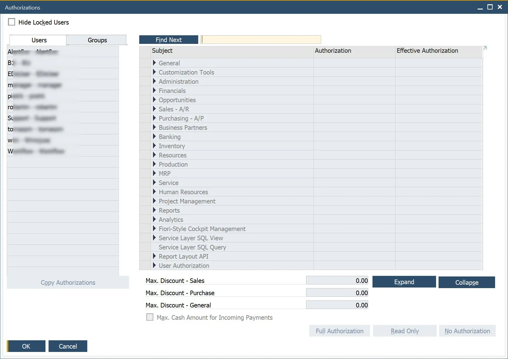

# Authorizations

The creation of ProcessForce documents depends on specific user authorizations

:::info Path
    Administration → System Initialization → Authorizations → General Authorizations
:::

Click a specific username to see and change authorizations assigned to a specific user.

Authorizations connected to ProcessForce specifically can be found in the Authorizations form → Users → ProcessForce.

A specific authorization can have one of three values:

- Full Authorization – user can create, change and post a specific document

- Read Only – user can open a document but cannot change it

- No Authorization – a lack of access to a specific document for a specific user

If the authorizations for a specific user are grayed out, the user has superuser privileges and owns all the authorizations.

You can set up superuser privileges in the Users form:

:::info Path
    Administration → Setup → General → Users
:::

Only users with a Professional license assigned can change authorizations.

Specific authorizations are required to work with specific ProcessForce documents, e.g.: to create, change and post Production Goods Receipt and Production Goods Issue and corresponding Pick Orders and Pick Receipt, you have to set Full Authorization for the following authorizations:

- Goods Receipt and Goods Issue: Authorizations form → Inventory → Inventory Transactions → Goods Receipt \[and] Goods Issue

- Journal Entry. This setting is required for Goods Receipt and Goods Issue to reflect on financials: Authorizations form → Financials → Journal Entry

- Pick Receipt and Pick Order: User Authorization → ProcessForce → Production → Inventory Transaction → Pick Receipt \[and] Pick Issue

- Numbering Series. This is needed for documents series management: Authorizations form → Administration → Numbering Series.
