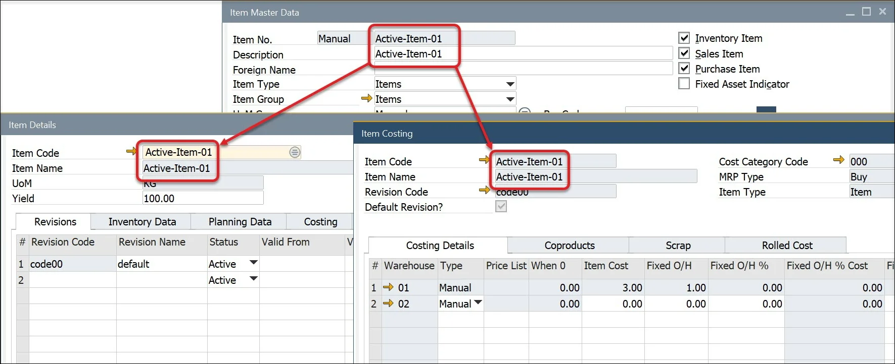
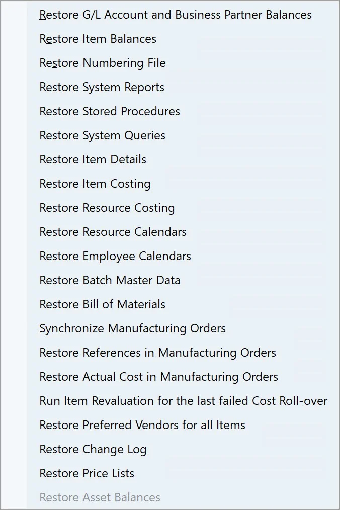
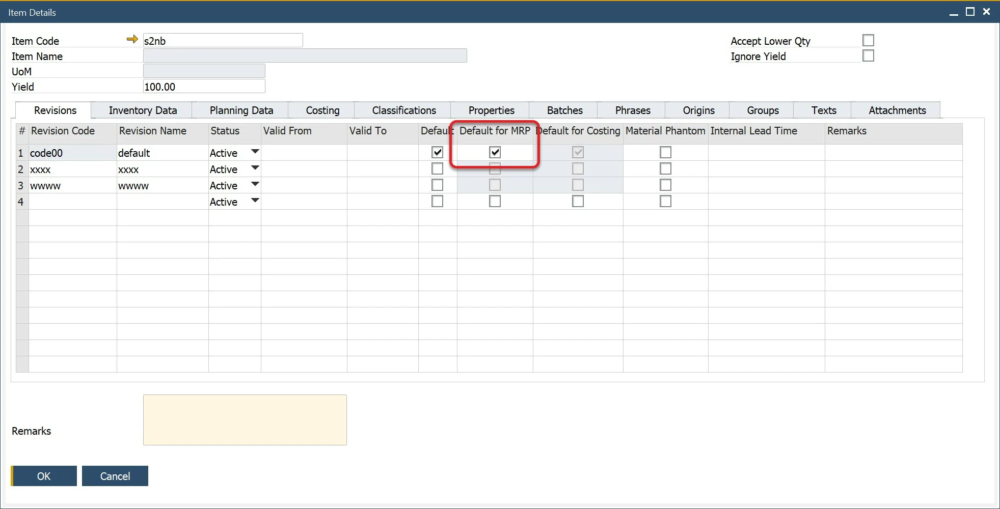
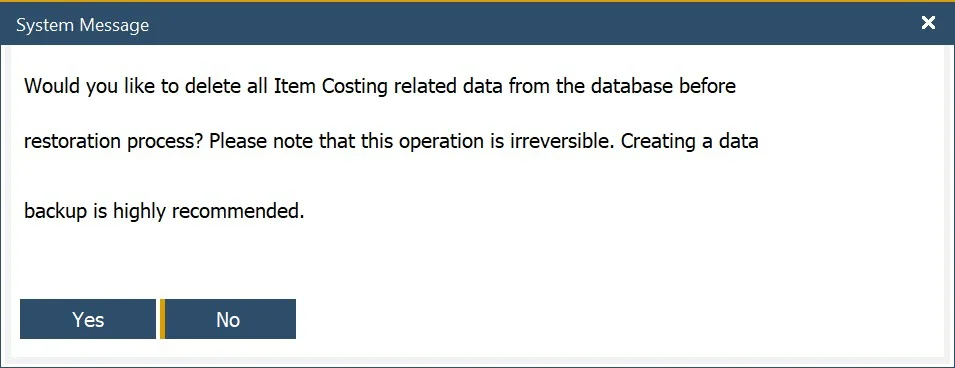

# Data restore

When a user adds, changes, or deletes Item Master Data within SAP Business One, essential data elements automatically update the ProcessForce Item Details <!-- TODO: Add Link --> (creates a default revision code) and Item Costing <!-- TODO: Add Link --> (creates a cost record for an item, revision, warehouse, Cost Category <!-- TODO: Add Link -->) objects.

If data has been added to SAP Business One manually or via DTW while ProcessForce is not installed and running, the Restore functions need to be run.

If the Restore function is not run, your SAP Business One and ProcessForce may run slowly as they try to find the Item Details and Cost data.

After installing ProcessForce, the following restore functions need to be run

- Batch Details

- Bill of Materials

---

## Full Restore functions list

## Restore Batch Details

:::info Path
    Help → Support Desk → Restore → Restore Batch Master Data
:::

To simplify batch information, the SAP Batch Details and ProcessForce Batch Master Data form has been consolidated into a single form.

Run the restore function to populate the combined data object.

If you add User-Defined Fields to the SAP B1 Batch Details tables, the same UDFs need to be added to the ProcessForce Batch Master Data tables.

If, for some reason, SAP and ProcessForce Batch Master Data for a specific Batch will not be consistent, using the Restore function will populate SAP Batch Details with ProcessForce Batch Master Data.

## Restore Bill of Materials

:::info Path
    Help → Support Desk → Restore → Restore Bill Of Materials
:::

When changing the Item description, for example, by DTW or Powershell, use the restore function to have the new Item description available within Choose From Lists and the Bill of Materials form.

Bill of Materials synchronization always goes from ProcessForce to SAP B1 data: creating a PF BOM and performing synchronization will create or overwrite SAP B1 Bill of Materials.

Restore Bill of Materials function works only when Enable Bill of Materials synchronization between ProcessForce and SAP Business One check box in General Settings form, ProcessForce tab, Bill of Materials and Manufacturing Orders is checked:

Click here to find out more about General Settings.

Only a Bill of Material variant with Is MRP Default check box checked on the Item Details form will be used for synchronization:

Please note that this functionality updates only the description in the Bill of Materials records. It does not synchronize the Production Tree and Bill of Materials. It synchronizes the ItemName from the OITM database table to the U_Description field of the CT_PF_OBOM database table.

## Restore Item Data

:::info Path
    Help → Support Desk → Restore → Restore Item Details

    Help → Support Desk → Restore → Restore Item Costing
:::

The Restore Item Details and Item Costing functions must be run in the following cases:

- ProcessForce is installed on a database that already had some Item Master Data records before the add-on installation

- ProcessForce is already installed, but Item Master Data record (or records) has been recorded when the add-on was not running

### Restore Item Details

For every Item Master Data record created in ProcessForce, an Item Details record is created automatically. If it is not created (e.g., when Item Master Data was created without ProcessForce), the Restore Item Details option will create it for a specific Item Master Data.

### Restore Item Costing

When the Restore Item Costing function is chosen, Item Costing records for every Item Master Data in every Revision and Cost Category will be created.

:::info
    Upon attempts to perform an Item Costing restore, the following system message appears:

    

    Note that by default, option No is marked.
:::

## Restore Resource Costing

:::info Path
    Help → Support Desk → Restore → Restore Resource Costing
:::

Records are created for every Resource in every Cost Category.

## Restore Resource Calendar and Employee Calendar

:::info Path
    Help → Support Desk → Restore → Restore Resource Calendars

    Help → Support Desk → Restore → Restore Employee Calendars
:::

When Resource or Employee Master Data is created in ProcessForce, a Calendar is created automatically. Using the Restore function creates Calendars for those Resource and Employee Master Data for those records that do not have it already (e.g., if Employee Master Data was created without ProcessForce).

## Goods Issue and Goods Receipt restore

This allows restoring all Goods Issues and Goods Receipts references in Manufacturing Orders documents.

The option's purpose is to cover the following cases: a Goods Issue / Goods Receipt document has been deleted, but the reference stayed in a Manufacturing Order → Document tab. This can cause an error while updating this Manufacturing Order.
