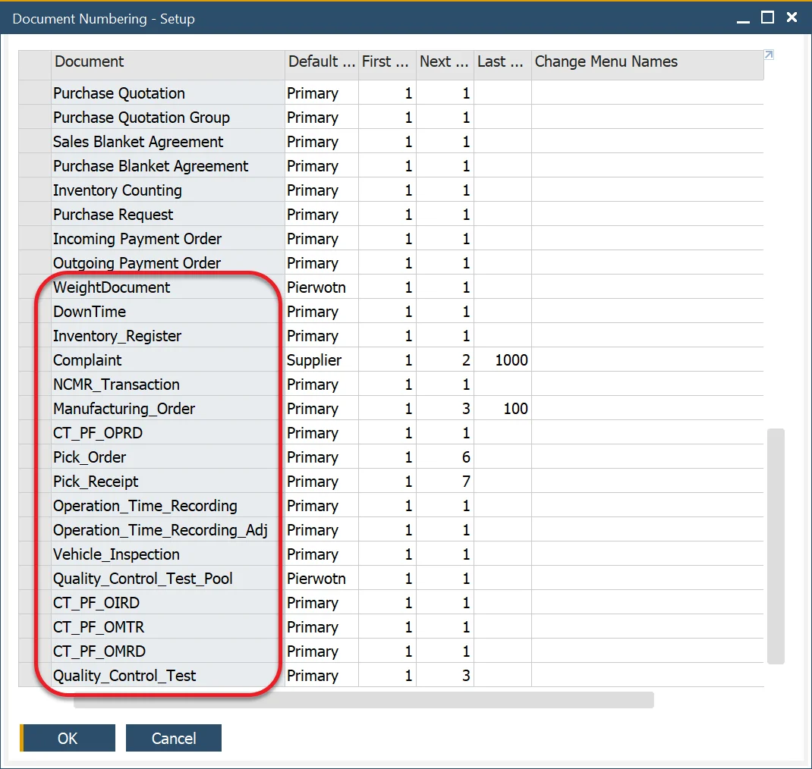
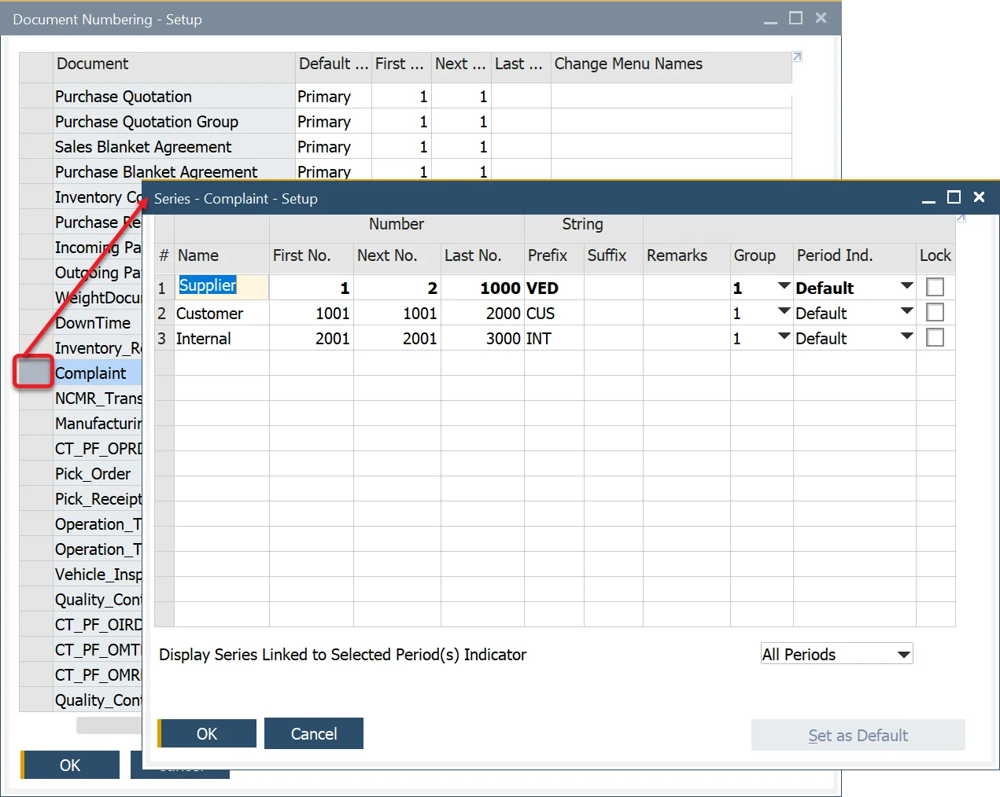
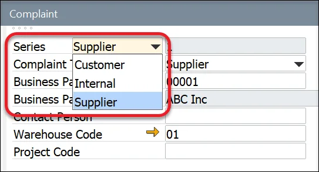

# Document Numbering

This function sets an automatic number to a newly created document. A default document series starts with 1. It can be changed for any other number. A freshly created document automatically obtains the next number in a series. Document Numbering is a standard SAP B1 function that also covers ProcessForce documents.

:::info Path
    Administration → System Initialization → Document Numbering
:::

---

This form sets up the document numbering series for the following transactions.

Multiple document numbering series for a transaction can be defined by double-clicking on the first column of a specific document type, e.g., Complaint.

To add a new series for a specific document type, in the form, right-click on the first column on the first row and choose 'Add Row'. Then set the first number of a series.

A specific series can be chosen for a particular document during its creation, causing filling up the document number field with a predefined next number.

