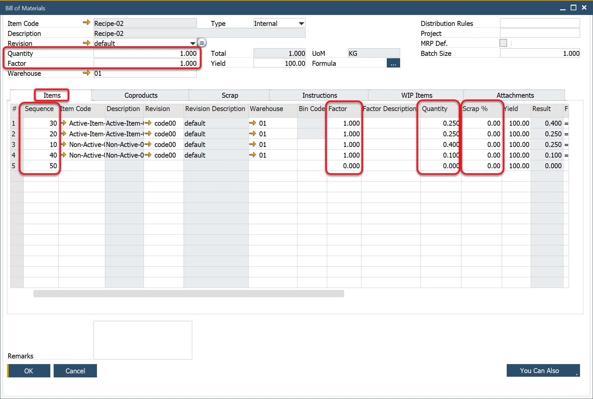
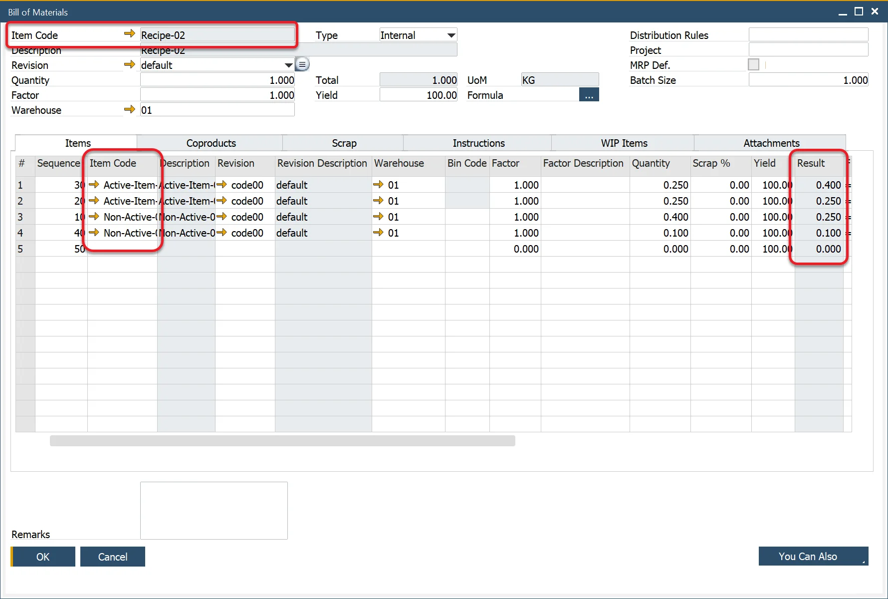

# Bill of Materials and Manufacturing Orders tab

You can define Bill of Materials and Manufacturing Orders settings on this tab, e.g., default formulas for Items.


## Default formula for Bill of Materials

ProcessForce provides a very flexible methodology for defining the relationship between parent Items, Coproducts, Scrap, Phantoms, Scrap Percentages, and Factors.

When creating a Bill of Material, these default formats are automatically added to each item.

The formula as displayed is added to this tab during the ProcessForce installation process.


### Default formulas

Items:

```sql
=U_Quantity()*U_Factor()*Items.U_Factor(<sequence>)*Items.U_Quantity(<sequence>)*100/(100 - Items.U_ScrapPercentage(<sequence>))
```

Coproducts:

```sql
=U_Quantity()*U_Factor()*CoProducts.U_Factor(<sequence>)*CoProducts.U_Quantity(<sequence>)
```

Scrap:

```sql
=U_Quantity()*U_Factor()*Scraps.U_Factor(<sequence>)*Scraps.U_Quantity(<sequence>)
```

Phantom

```sql
=U_Quantity()*U_Factor()*Phantoms.U_Factor(<sequence>)*Phantoms.U_Quantity(<sequence>)
```

Naming:

|                          Items Tab                          |                       Coproducts Tab                        |                        Scrap Tab                         |                       Phantoms Tab                       |
| :---------------------------------------------------------: | :---------------------------------------------------------: | :------------------------------------------------------: | :------------------------------------------------------: |
| ```U_Quantity = Quantity field value within the form header |  U_Quantity = Quantity field value within the form header   | U_Quantity = Quantity field value within the form header | U_Quantity = Quantity field value within the form header |
|    U_Factor = Factor field value within the form header     |    U_Factor = Factor field value within the form header     |   U_Factor = Factor field value within the form header   |   U_Factor = Factor field value within the form header   |
|             Items.U_Factor = Factor field value             |          CoProducts.U_Factor = Factor field value           |           Scrap.U_Factor = Factor field value            |          Phantom.U_Factor = Factor field value           |
|           Items.U_Quantity = Quantity field value           |        CoProducts.U_Quantity = Quantity field value         |         Scrap.U_Quantity = Quantity field value          |        Phantom.U_Quantity = Quantity field value         |
|   Items.U_ScrapPercentage = Scrap Percentage field value    | CoProducts.U_ScrapPercentage = Scrap Percentage field value |  Scrap.U_ScrapPercentage = Scrap Percentage field value  | Phantom.U_ScrapPercentage = Scrap Percentage field value |
|      `<sequence>` = sequence number of the item master      |      `<sequence>` = sequence number of the item master      |    `<sequence>` = sequence number of the item master     |    `<sequence>` = sequence number of the item master     |



There are no default formulas set up for Yield. Click here to find out more about defining formulas for Yield.

## Enable Synchronization

- SAP Business One uses information from the Item Master Data Inventory Data tab to calculate MRP make and buy recommendations requirements.
- ProcessForce uses the SAP Business One MRP Wizard, and this synchronization method allows this integration to occur.
- Additional details are also covered in the MRP Tab

### Bill of Materials

- Check this box to have the ProcessForce Bill of Material data sync with the SAP Business One Bill of Material object
- The key data sync to SAP Business One is the values from the Result Column.



### Manufacturing Orders

:::caution
    To enable synchronization, the same document numbering series must be set for SAP Production Orders and ProcessForce ManufacturingOrdersr. You can check here how to do that.
:::

- Check this box to have the ProcessForce Manufacturing Order sync with the SAP Business One Production Order object
- The key data sync to SAP Business One is the values from the planned and Actual Quantity


### Due Date Synchronization

SAP Production Order has a Due Date on it. On ProcessForce Manufacturing Order, you can set the Required Date and Planned Start Date. You can choose which ProcessForce Manufacturing Order date synchronizes SAP Production Order Due Date.


## Default priority for production

You can set up Manufacturing Order Priority for Scheduling Board. One is the highest and ten lowest.

In General Settings, you can set up a default priority for all newly created Manufacturing Orders.

### Priority Level

Suppose Default Priority is set on Business Partner Master Data level (considered when creating Manufacturing Order from Sales Order by Scheduling Board). In that case, it is taken from there for every newly created Manufacturing Order for this partner:

:::info Path
    Suppose Default Priority is set on Business Partner Master Data level (considered when creating Manufacturing Order from Sales Order by Scheduling Board). In that case, it is taken from there for every newly created Manufacturing Order for this partner:
:::


If Default Priority is set up to "0" on Business Partner Master Data, it is taken from General Settings.

### Manufacturing Order

You can check (and change – if it is in any other than Finished status) Priority for a specific Manufacturing Order:

:::info Path
    Production → Manufacturing Order → Manufacturing Orders → Others tab
:::


## Use MRP Minimum Quantity and Order Multiple for Semi Manufacturing Order Quantities checkbox

This option allows us to take Sales Order options (Minimum and Maximum Quantity, Order Multiple) under consideration when creating Semi Finished Manufacturing Orders suggestions on Scheduling Board. This gives the sales operator a tool to accurately estimate arrival time.

## Sum Semi Finished checkbox

A new checkbox has been added to the tab: Sum Semi Finished

By default, a separate Manufacturing Order is created for the same Semi Finished Item used more than once on a Manufacturing Order.

**Example:**

When the same semi-finished material is listed as two sequence steps on a Manufacturing Order to allow binding to different operation steps, two Manufacturing Orders are created for the semi-finished product.

When the checkbox is unchecked, the default behavior is realized.

When the checkbox is checked, one Manufacturing Order is created for all the same Items. It sums the quantity from all of the entries.

## Use MRP Maximum Quantity for Semi Manufacturing Orders

## Use Resource Balancing

Click here <!-- TODO: Add Link --> to find out more.

## Show Manufacturing Order relations at Gantt

## Copy classification code from Manufacturing Order during the Pick Receipt creation

## Automatically Calculate Ratio on Operations

You have the option to enable the "Automatically Calculate Ratio on Operations" feature in the General Settings, under the ProcessForce, Bill of Materials, and Manufacturing Orders tab. When activated, this feature automatically computes the Ratio (and Quantity). For instance, if you add an Item to two Operations, the ratio will be set to 0.5, and the Binding Quantity will be calculated based on the balance and the corresponding Bill of Materials quantity.

For more details, click [here](../../formulations-and-bill-of-materials/production-process/overview.md#operation-bind-ratio)
