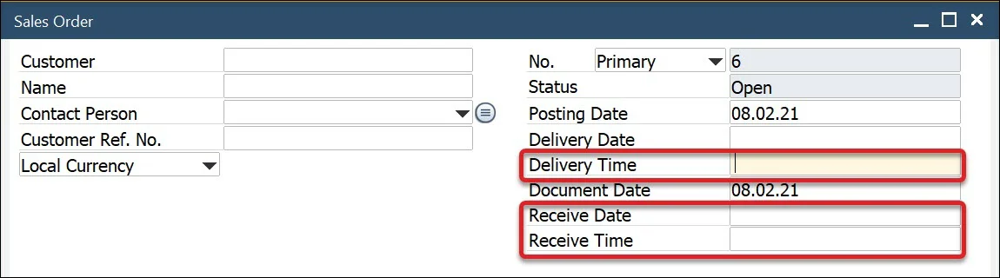

# General Tab

**Enable standard functionality of SAP Business One's Production menu** – in enabled status all the SAP Business One menu entries are visible

**Enable the standard functionality of the Resources menu** – in enabled status standard SAP Business One Resource menu options are available (apart from ProcessForce Resource option)

**Display on the Gantt chart** – a value by default displayed on the Gantt chart. You can choose an option from the drop-down list (available: Related Resource Code, Resource Remarks, Manufacturing Order Number, Item Code, Planned Quantity, Actual Quantity, Required Date and Priority).

:::tip
    You can use the Resource Remarks field to display any text on Gantt work progress bars.
:::

**Default Revision Code, Default Revision Nam**e – select the default Revision Code and Revision name for the global assignment.

**Automatically issue materials on Pick Order Add/Update, Automatically receipt materials on Pick Receipt Add/Update** – set up Auto Pick and Auto Receipt.

    
Click here to find out more

    

        The process flow of picking and receiving materials has been simplified by checking one or both options.

        For more details, click here<!-- TODO: Add Link -->.
    
        **Pick Issue**

        Perform the usual steps of picking non-trace and batch-traced Items.

        Click Update on the Pick Issue Form.

        The Issue to Production transaction is automatically created.

        Pick Order is updated and set to Close status.

        Documents are visible within the Manufacturing Order > Document tab.

        **Pick Receipt**

        Record the quantity of the Items received from production.

        Click Update.

        Receipt from Production is automatically created.

        Pick Receipt is closed.

        Documents are visible within the Manufacturing Order Document tab.
    

**Add setup time to a new task when rescheduling** – when Task on Manufacturing Order is partially booked, and we want to reschedule the not done part, it has its own setup time again when this option is checked.

**Start with Planning Board in Scheduling** – decide whether Scheduling opens on the Resources or Resource Planning Board tab <!-- TODO: Add Link -->.

**Default Gantt chart time scale** – self-explanatory. You can choose between Days, Weeks, and Months

**Automatically check MORs in lists** – if this checkbox is checked, Manufacturing Order lines are checked by default on forms, e.g., on Scheduling Board:

    
Click here to find out more

    

        
    

**Automatically select linked children of MORs** – when this checkbox is checked, the Link ChildMors checkbox is checked on the Scheduling Board form (Create Manufacturing Orders option from the context menu on the Sales Order form).

**Disable copying of the revisions after duplicating the item** – determines whether to copy related Revisions during Item Master Data duplication

**Hide ProcessForce-related controls on the Sales Order form** – determines whether ProcessForce-related controls are present on Sales Order's header:

    
Click here to find out more

    

        
    

**Hide Resource Information on Resource Planning Board** – checking this check box causes the panel with Resource Information not to be displayed on Resource Planning Board

    
Click here to find out more

    

        
    

**HANA Reports limit: Date From, Date To** – the option is related to one of the Data Model reports. It limits the results to the ones within specific time constraints.
