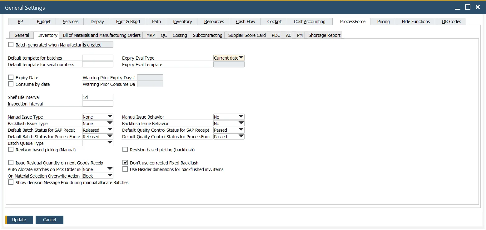

# Inventory tab

This tab allows setting extended settings for many inventory values, such as Batch and Serial Numbers management, issue method, or quality control settings.

---

**Batch generated when Manufacturing Order** – if checked, you can choose one of the four options from a drop-down list to allocate a batch number when creating a Manufacturing Order or changing its status:

- on creating MOR (not possible to use %MORDN% parameter in a template due to performance issues)
- on changing status to Scheduled
- on changing status to Released
- on changing status to Started.

**Default template for batches, Default templates for serial numbers** – it can be chosen from a list. Click here to check how to create a new Batch or Serial Number template.

**Expiry date settings** – Expiry Evaluation Type can be set by a specific date (current, start, required, end, create) or by a template. A template can be chosen from a list or modified (if it is already created). The Expiry Eval Template field is active when the Expiry Eval Template value is selected in the Expiry Eval Type field. Click here to find out more about Expiry Evaluation Type Templates.
A default expiry alert can be set in the Warning Prior Expiry Days field. It will be displayed a given number of days before the expiry date. It is only available when the Expiry Date check box is checked. Click here to find out more.
A default consumes alert can be set in Warning Prior Consume Days. It will be displayed a given number of days before the Consume Date. It is only available when Consume Date check box is checked.
Note that only one of these options can be active at a time: either Expiry Date or Consume By Date.

**Shelf Life Interval** – a period used to calculate the expiry date automatically. E.g., if Shelf Life Interval is set to 30 days and a Batch record is made on June 1st, the Expiry date will be automatically charged to June 30th.

**Inspection interval** – a period between consecutive inspections. After each period, an alert about the Inspection is activated.

**Manual Issue Type, Backflush Issue Type** – consumption rules during manual picking and backflushing when the Batch status is locked and/or non-accessible. You can find information about it here <!-- TODO: Add Link -->.

**Default Batch Status for SAP Business One and ProcessForce receipt documents**:

- Released, Locked, or Not Accessible

- If the status for a Batch is set to Not Accessible or Locked, a system message about this will be displayed before issuing this batch for production.

- Click here <!-- TODO: Add Link --> to find out more.

**Default Quality Control Status for SAP Business One ProcessForce receipt-based documents:**

Failed, On Hold, Inspection, Passed, and Quality Control Testing options are available.

Click here <!-- TODO: Add Link --> to find out more.

Batch Queue Type – a type of queue used by default with batches:

- FIFO – First In, First Out
- FEFO – First Expired First Out
- FMFO – First Manufactured First Out.

**Manual Issue Behavior**

**Backflush Issue Behavior**

**Default Quality Control Status for SAP Receipt Documents**

**Default Quality Control Status for ProcessForce Receipt Documents**

**Revision Based Picking and Backflushing** <!-- TODO: Add Link -->

**Issue Residual Quantity on next Good Receipts when possible** – if the option is checked, then during the following Goods Receipt for the same Manufacturing Order, the system will try to issue again all of the rows with the Backflush issue type set for which Residual Quantity is higher than zero and have a quantity to issue (because it was not on the stock during the previous receipts)

**AutoAllocate Batches on Pick Order Include**: defines on which documents Batch Allocation should be analyzed when using Auto Select and Auto Select All actions:

- **None** – no documents are taken under consideration
- **On other document** – takes under consideration allocations from Pick Orders
- **Allocated** – takes under consideration allocations from Sales Orders
- **Both** – takes under consideration allocations from Pick Orders and Sales Orders

**On Material Selection Overwrite Action** – related to the previous point. Determines the system’s reaction on exceeding available not allocated quantity with manual Batch/Serials choosing. Options: Allow, Warn, Block

**Show decision Message Box during manual allocate Batches** – when checked: in case of manual choosing from available Batches/Serials in an order different than suggested by Selector, a warning is displayed

**Don't use corrected Fixed Backflush** – If this check box is checked, the receipt from production works correctly even if we receipt more Final Good than it is planned. If this checkbox is unchecked, if we receipt more than what is planned, it backflushes again the whole planned quantity

**Use Header dimensions for backflushed inv. items**
