# MRP related configuration

SAP Business One MRP related options.

**When running SAP Business One MRP please ensure the following:**

## Configuration

### Configuration fields

- This fields will ensure that the ProcessForce Bill of Material and Manufacturing Order will sync with SAP Business One
- If you do not check the sync box, and you enter BOMs into ProcessForce they will not sync with SAP Business One
- If you have entered Bill of Materials into ProcessForce and then want to sync into SAP Business One, just change a data element within the ProcessForce BOM, press update and the BOM will then sync with SAP
- Also review the settings in the Coproducts section below, even if you are not using Coproducts
- This synchronization will allow the supply and demand details from ProcessForce Manufacturing Orders to update and make use of the following SAP Business One forms and processes:
  - Item Master Data -> Inventory Tab -> Committed and Ordered fields
  - Forecasts
  - MRP wizard
  - Order Recommendation
  - Available to Promise
  - BOM Relationship Maps

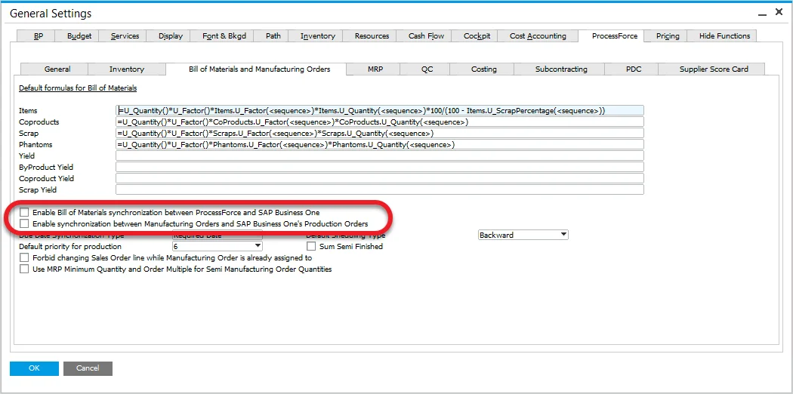

## Documents Series

- Create an SAP Production Order and ProcessForce Manufacturing Order with the same starting and ending number:
    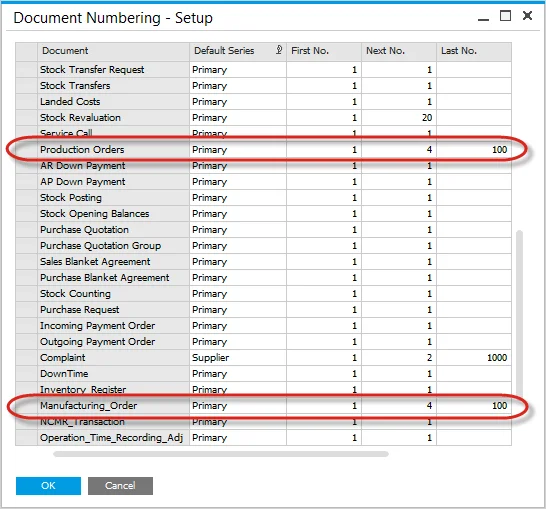
    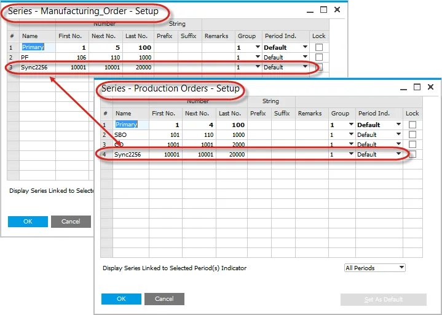

### Example

On the screenshot below you can check an example of Manufacturing Order - Production Order series synchronization:
2017PF series (Manufacturing Order series) is synchronized with 2017SAP series (Production Order series).

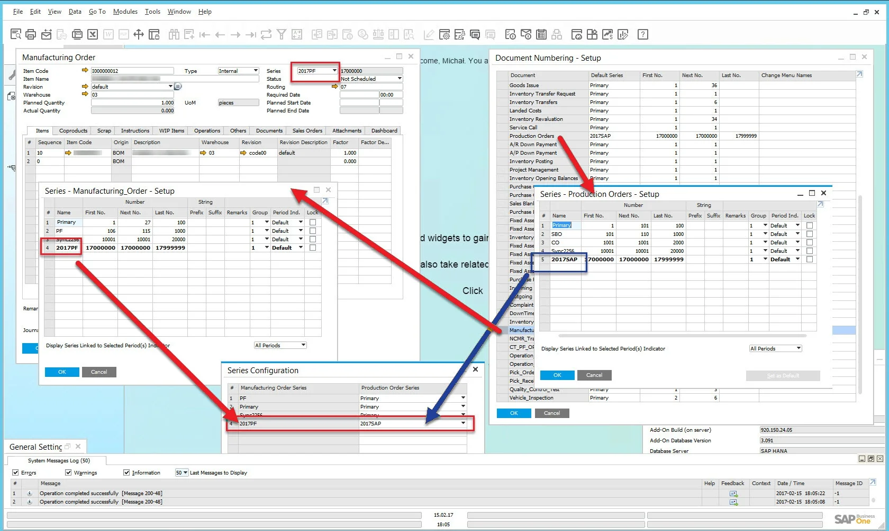

## Multiple Manufacturing Order - Production Order series synchronization

:::info
    Values are needed only when the company uses branches.
:::

The option is available from:

- General Settings form:
    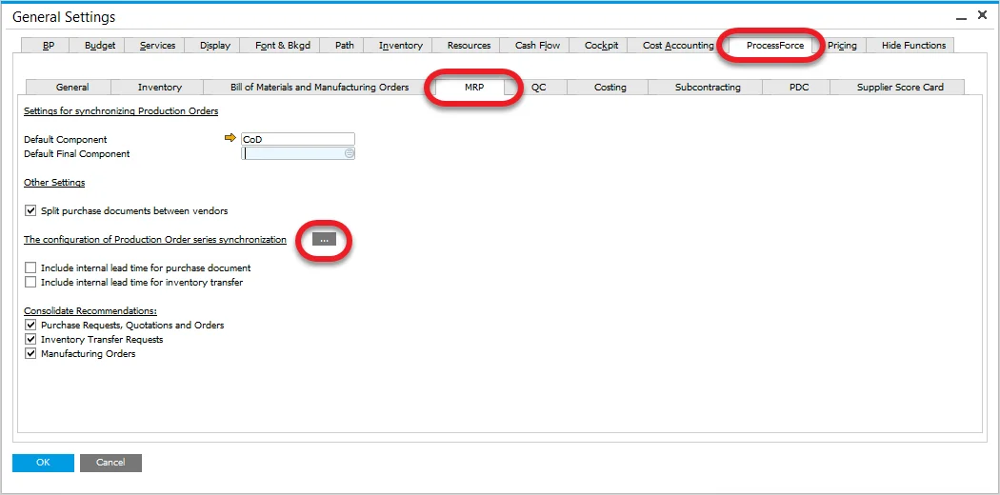
- Main Menu: Administration → System Initialization → Configuration of Series Synchronization

The following form will be displayed:

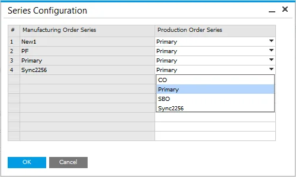

In this form you can assign predefined Production Order document series to specific Manufacturing Order document series.

Click [here](../../document-numbering.md) to check how to create a document series.

## Transactions

- When entering a Manufacturing Order, please ensure that you use the correct document series.
- To reduce the error of entering the wrong value, assign the document series to the user.

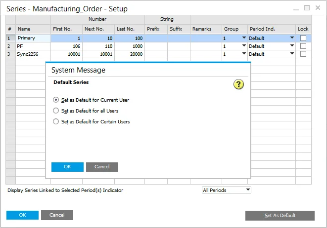

## Coproducts

For those enterprises that produce Coproducts, this form is required to be completed for ProcessForce to take advantage of SAP Business One MRP functions.

SAP Business One does not manage the concept of Coproducts within its Bill of Material function. Therefore, when the Bill of Manufacturing and Manufacturing Order synchronization occurs, a dummy Bill of Material is created, with the parent Item being the Coproduct and component Item number being the Default Component set within this form. Go to the next paragraph to check how to configure Default Component.

## Default Component

The default component should have the following settings:

- Item Master Data Header – Sales Item, Inventory Item, Purchase Item, Fixed Asset Item set to 'unchecked'

    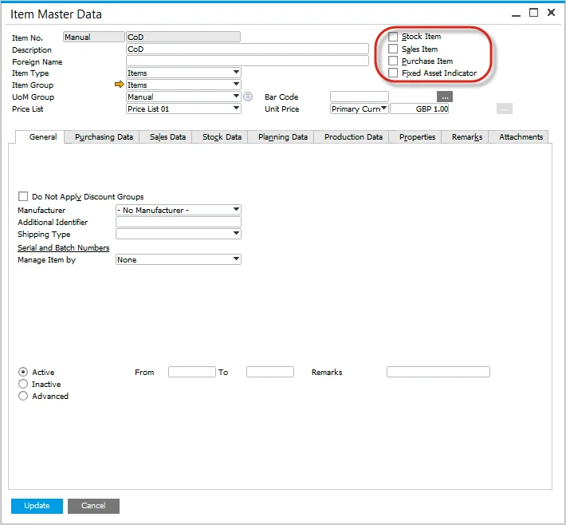
- Item Master Data → General Tab – Serial and Batch numbers, manage by item set to 'None'

    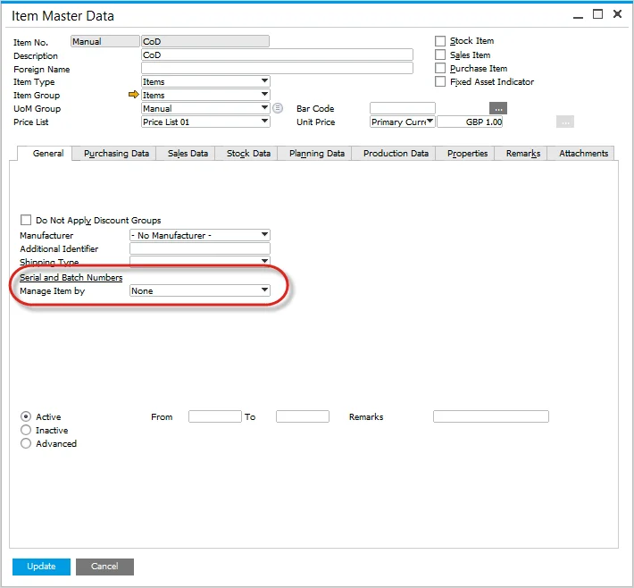
- Item Master Data → Production Data tab – Phantom item set to unchecked

    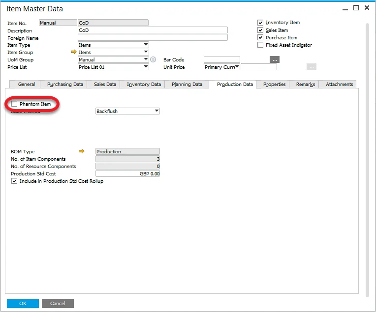
- Item Master Data → Inventory Data tab – Valuation Method set to Standard, Item Cost set to 1, mark one of the warehouses as default

    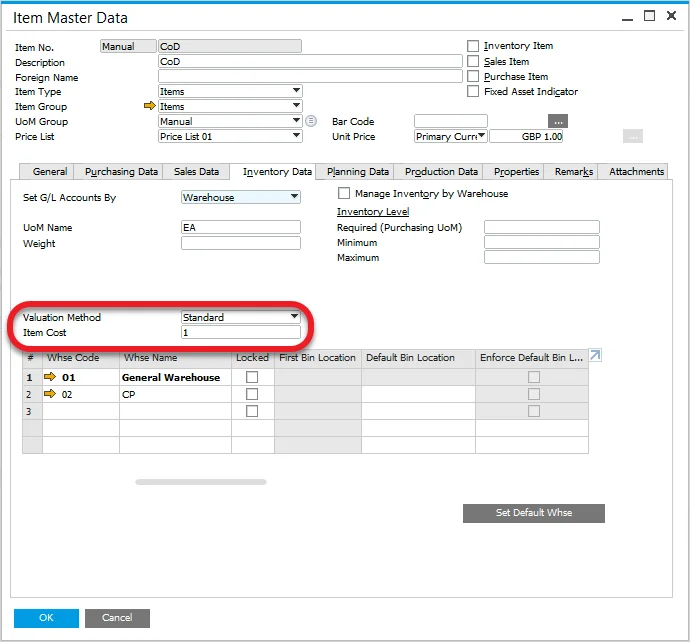

You can mark a warehouse as default by clicking the first column of its row and then clicking Set Default Whse button:

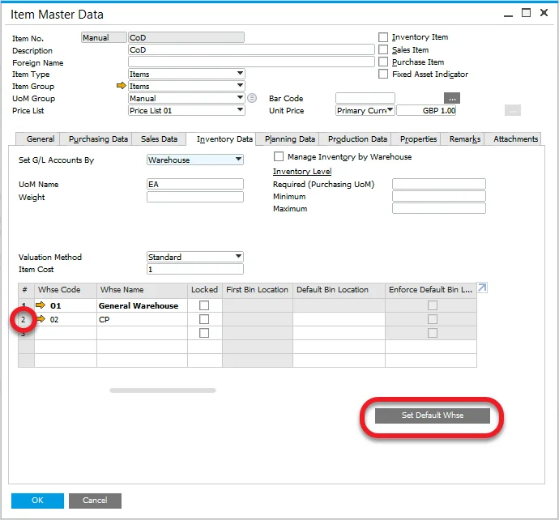

## Default Final Component

Item set up as a Default Final Component is excluded from MRP runs.

This option is available from [General Settings > ProcessForce tab > MRP tab](./mrp-tab.md):

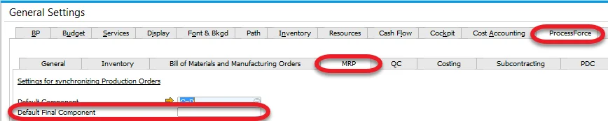

### Settings

An Item to be chosen as a Default Final Component has to be set up in the following way:

- Inventory Item option checked,
- Sales/Purchase/Fixed Asset - unchecked,
- cannot be managed by Serial or Batch numbers,
- a default Warehouse chosen
- a Valuation method is set to Standard

:::note
    Please go to the [Coproducts section](#coproducts) to check where to set up the aforementioned settings
:::

## 10.0 R3: Multiple Branches management of Default Component and Default Final Component

From this version it is possible to configure Default Component and Default Final Component differently for different SAP Business one Company Branches.

The following steps have to be performed to use the option:

1. In SAP Business One form Branches - Setup each Branch has to have a default Warehouse set.
2. For each Branch a separate Default Component has to be created.
3. In each Default Component per Branch, a related Branch Warehouses have to be set with at least one of them set as default in Item Master Data.
4. In ProcessForce Branches: Components Configuration (available from General Settings > ProcessForce tab > MRP tab > components configuration for branches) set a default Warehouse – make sure to assign proper Warehouse keep attention on warehouse assignment to the branch.

The same procedure applies to Default Final Component. Please keep in mind that it is important to define a Default Component for a specific Branch and then Default Final Component.

## Settings significant for MRP

### Split purchase documents between vendors

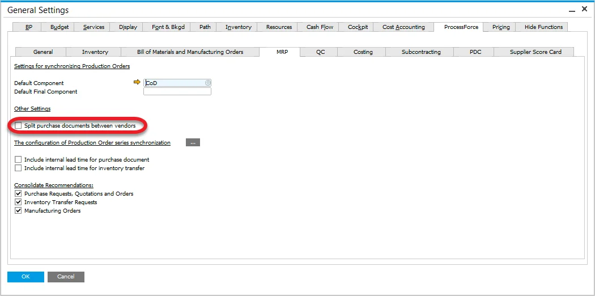

By choosing this option it is possible to split purchases between preferred vendors.

Checking the checkbox results in access to the following form from Item Master Data form, Planning Data tab:

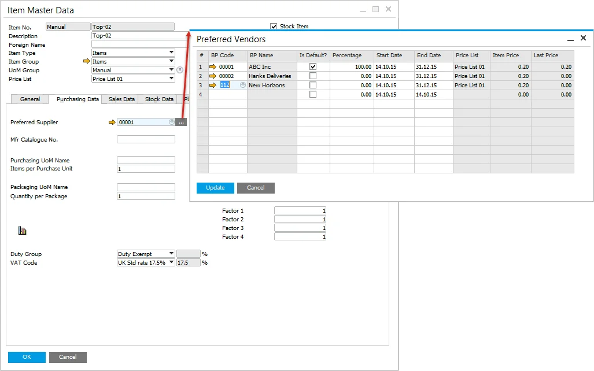

On this form you can set a preferred vendor and percentage. If percentage is set for vendors, quantity from a purchase document for the specific Item will be divided proportionally according to it.

Also, please check the table at the bottom of this page.

### Minimum and Maximum Manufacturing Order planned quantity

You can set minimum and maximum order quantity in Item Master Data, Planning Data tab:

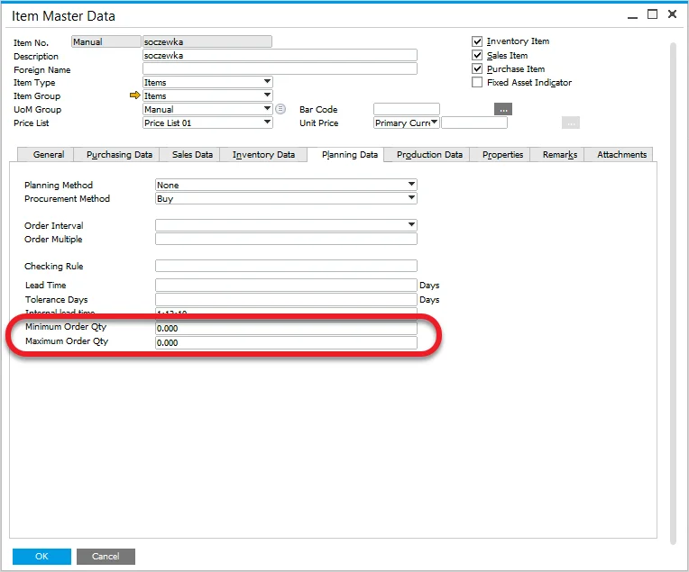

The result of preferred vendors and minimum and maximum quantity is presented in the table below (click to enlarge).

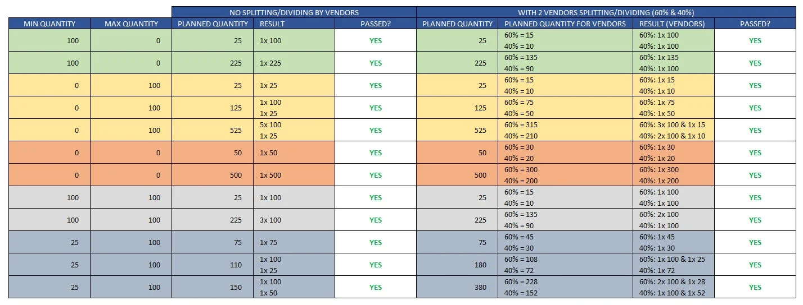
