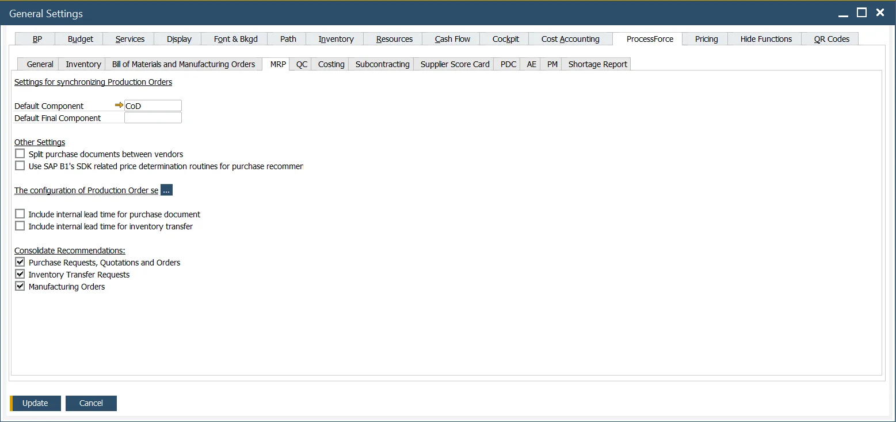
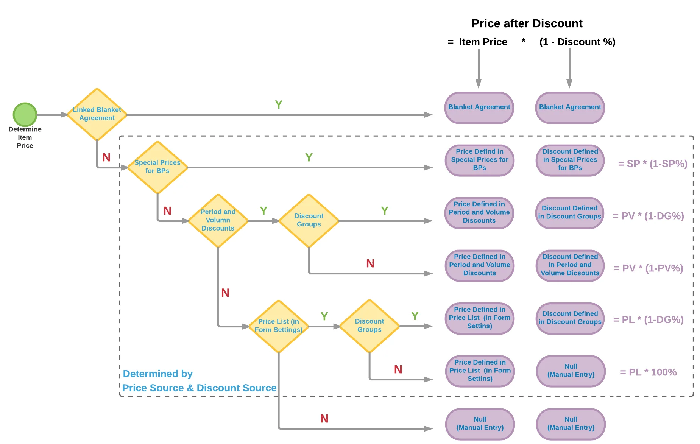

# MRP tab

**Default Component** – click [here](./mrp-related-configuration.md#default-component) to find out more

**Default Final Component** – default Final Component is a dummy Item used in the synchronization mechanism (between ProcessForce Manufacturing Order and SAP Business OneProduction Order). This dummy Item is used in SAP Production Order (header) when synchronization of Manufacturing Order's Final Good is zero: (Planned - Actual)>=0. Specifying this Item in General Settings allows the synchronization to work properly. Item set up as a Default Final Component is excluded from MRP runs.

**Split purchase documents between vendors** – click here<!-- TODO: Add Link --> to find out more

**Use SAP B1's SDK related price determination routines for purchase recommendations** – checking this checkbox causes standard SAP Business One price determination for purchase recommendation to be used. The following chart presents this price recommendation scheme and hierarchy. The price is taken from the top level of the chart (Blanket Agreement), if not, then from the lower level. The lowest level is manual entry of prices:

The ProcessForce price recommendation works only down to the Special Prices for Business Partners level. Check the checkbox if you need to use the lower then this level for price recommendation. Otherwise it is possible to uncheck the checkbox for performance improvement

**Include internal lead time for purchase document** - Lead Time is the number of days from when the item is ordered to when the item is received or produced.

**Include internal lead time for inventory transfer** - Internal lead time is similar to additional time (for example for quality control or preparing to dispatch)

**Consolidate Recommendations** - When this option is activated, and if multiple recommendations exist for the same product, they will be merged into a single recommendation.
