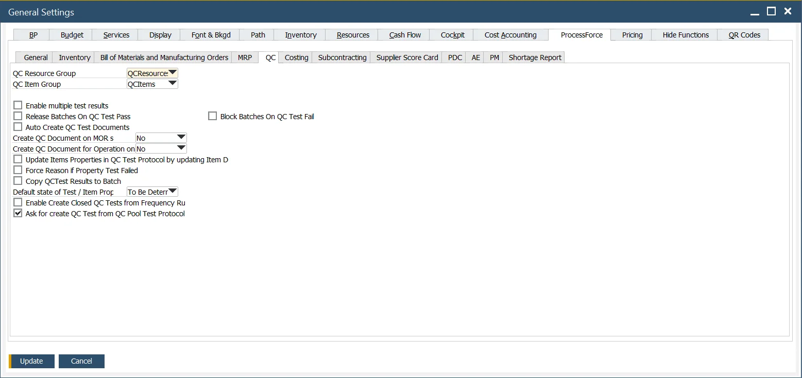
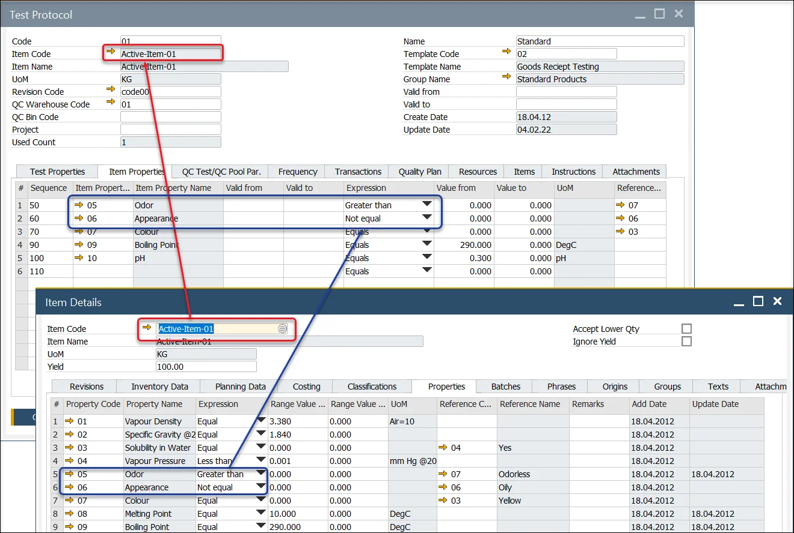
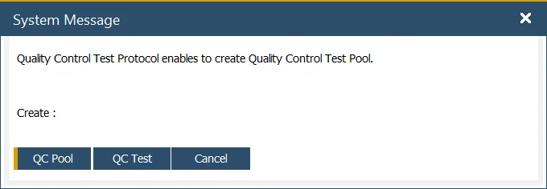

# QC tab

**QC Resource Group, QC Item** – within the Test Protocol and Quality Control Test Forms, the user can define the Resources and Items used to conduct and complete the testing activity. For example, X-ray machines, microscopes, tooling, etc. Use QC Resource Group and QC Item Group options to choose groups that will be used for Quality Control Tests.

Click here <!-- TODO: Add Link --> to learn about Items and Resources for Quality Control Test configuration.

**Enable multiple test results** – check this field to record multiple results against the Test and Item Property.

Note: when this function is checked, all Test and Item Properties data entries will be managed using this method.

Click here <!-- TODO: Add Link --> to find out more about the Multiple Test Results function.

**Release Batches on QC Test Pass** – Checkbox checked: If QC Test status is changed to passed and document status changes to closed, assign Batches' status to Released (if any Batch is assigned to a Quality Control Test - Quality Control Test > Transaction tab).

**Auto Create QC Test Documents** – this option allows the automatic creation of Quality Control Tests when specific conditions are met. Click here to find out more.

**Create QC Document on MOR state** – this option determines if a related Quality Control is to be created upon a Manufacturing Order status change. It is possible to set a shift in one status or turn the option off ('No' on the drop-down list).

**Create QC Document for Operation on MOR state** – this option determines if a related Quality Control is to be created for an Operation upon a Manufacturing Order status change. It is possible to set a shift of the statuses or to turn it off ('No' on the drop-down list). It is required to check the QC Active checkbox <!-- TODO: Add Link --> for this option to be available for a specific Operation.

**Update Items Properties in QC Test Protocol by updating Item Details Properties** – if this checkbox is checked, Item Properties on Quality Control Test Protocol are updated automatically upon the related Item Details Properties update.

    
Click here to find out more

    

        
    

**Force Reason if Property Test Failed** – if this checkbox is checked, it is impossible to save/update a Quality Control Test document with a failed Test/Item Property that does not have a Reason Code and Name set.

**Copy QCTest Results to Batch** – when a Quality Control test is moved to the Closed status, the Tested Values and Tested Reference Codes of Item Properties are copied to the related Batch Master Data.

Suppose during the copy process, the system finds any Item Property from the Quality Control Test that is not already part of the Batch Master Data, Properties Tab. In that case, the Item Property is added to the list.

**Default state of Test / Item Properties** – you can define a default state (To be determined / Pass / Fail / Not Affected)) for Test and Item Properties upon adding a Test Protocol (it affects all the Properties in the Protocol) or a Property to a Quality Control Test.

**Enable Create Closed QC Tests from Frequency Rules** – if a Quality Control Test is created automatically (following the Frequency mechanism (Test Protocol, Frequency tab)), checking this option causes the creation of Quality Control Tests in Closed status and Pass result between the counter values, e.g., when creating a Quality Control Test every five transactions, for the first four the closed Tests are created, and the fifth one is a proper Quality Control Test.

**Ask for creating QC Test from QC Pool Test Protocol** – if you create a test manually and choose a Test Protocol for Quality Control Test Pool and the checkbox is checked, you will be able to decide to create a single Quality Control Test or a Quality Control Test Pool. If the checkbox is unchecked, the system will automatically go to Quality Control Test Pool creation.

    
Click here to find out more

    

        
    

**Block Batches on QC Test Fail** – self-explanatory.
