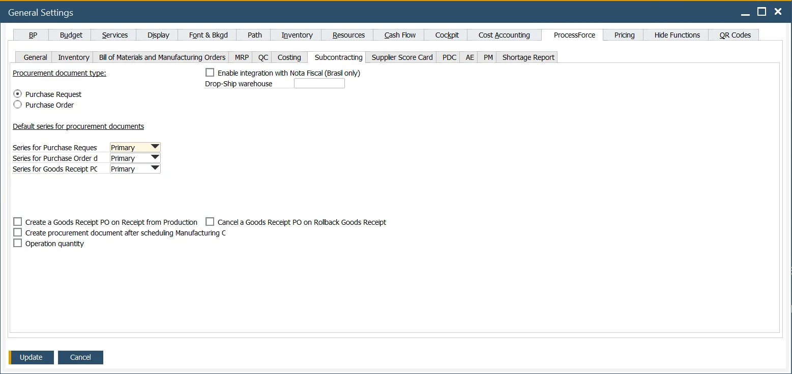

# Subcontracting Tab

Subcontracting is a method of managing the “purchase of a service.” For example, items are sent to the subcontractor to perform a service, e.g., painting, heat treatment, or annealing.

---

**Procurement document type** – Purchase Request or Purchase Order can be picked as a default procurement document for External type Manufacturing Order.

**Default series for procurement documents** – this setting allows setting if Purchase Request or Order and Goods Receipt PO are created with an automatically assigned document numbering series or if this number is given manually. Document series can be chosen from the adrop-down list. Only series previously defined are available in the list. To check how to create a document numbering, click here <!-- TODO: Add Link -->.

**Create a Goods Receipt PO on Receipt from Production** – self-explanatory.

**Create procurement document after scheduling Manufacturing Order** – checking this option causes the automatic generation of Purchase Order or Purchase Order Request for subcontracting after posting Manufacturing Order. Click here <!-- TODO: Add Link --> for more information.

**Operation quantity** – when this field is checked, when creating a service Purchase Order, the quantity on the Purchase Order will be equal to the Manufacturing Order quantity. This setting is only valid when using the Resource as a Subcontractor method.

**Enable integration with Nota Fiscal (Brazil only)**

**Drop-Ship warehouse** – This option is related to Brazilian localization and can be used only within it. Click here to find out more. Drop-ship Warehouse in the ProcessForce subcontracting context marks a virtual warehouse. Creating an Inventory Transfer document to this Warehouse represents sending materials to a Subcontractor. After that, it is possible to create Issues and Receipts from this warehouse.
