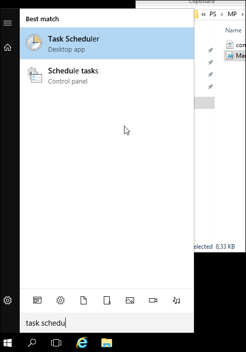
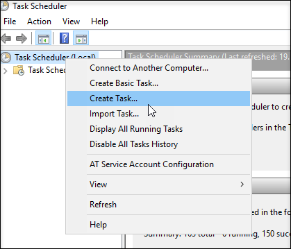
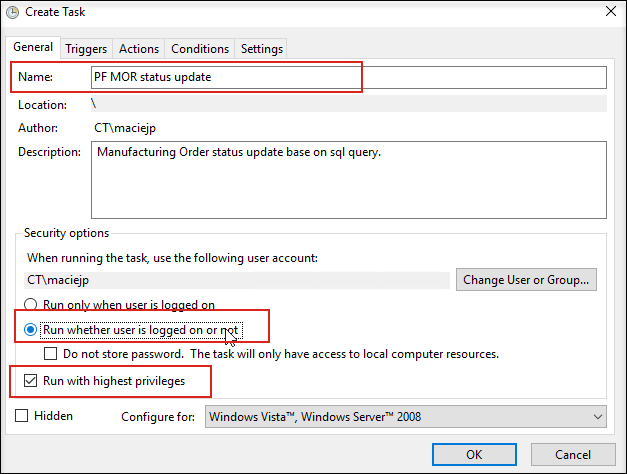
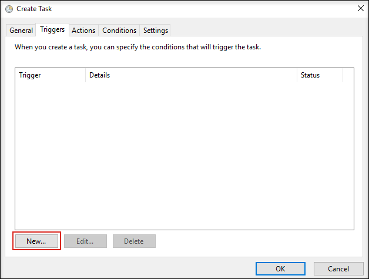
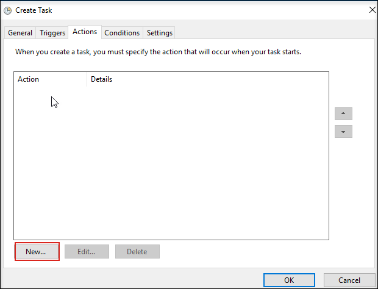
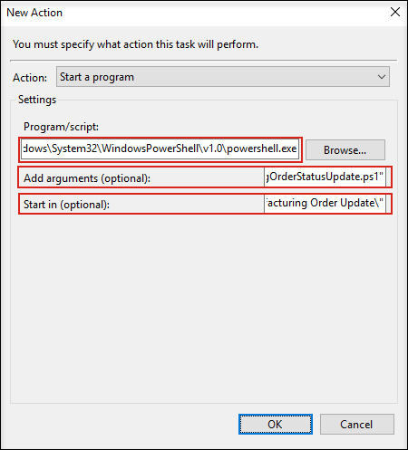
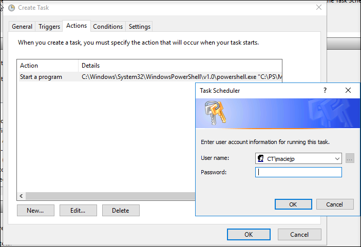
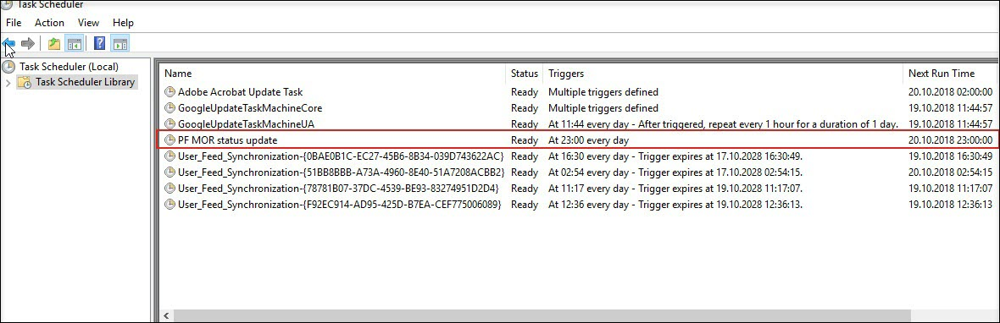

# Scheduling PowerShell scripts

You can use Windows Task Scheduler to run your script automatically.

**Requirements**:

- powershell.exe location on your server. By default, it is C:\Windows\System32\WindowsPowerShell\v1.0\powershell.exe for 64-bit and C:\Windows\syswow64\WindowsPowerShell\v1.0\powershell.exe for 32-bit

- path to PowerShell script. For example: C:\PS\MP\PF\powershell-scripts\Production\Manufacturing Order\Manufacturing Order Update\ManufacturingOrderStatusUpdate.ps1.

**Steps**:

1. Open Windows Task Scheduler:

    

2. Choose the Create Task option from the context menu (right-click on Task Scheduler (Local)).

    

3. Provide a name for the Task and, optionally Description. Select Run whether the user is logged on or not. You can also choose to Run with the highest privileges depending on your system settings.

    

4. In the Triggers tab, you can specify when this task should run. To add a trigger, choose New...

    

5. Define trigger. The below example task will run every day at 23:00 starting from 20.10.2018.

    

6. On the Action tab, you define actions that will be executed when the task starts. Click on New to add Action.

    

7. Provide values for the fields:

    a. **Program/script** – paste the path to powershell.exe, e.g.: C:\Windows\System32\WindowsPowerShell\v1.0\powershell.exe.

    b. **Add arguments (optional)** – paste the path to the PowerShell script. Put it in quotation marks. For example: "C:\PS\MP\PF\powershell-scripts\Production\Manufacturing Order\Manufacturing Order Update\ManufacturingOrderStatusUpdate.ps1"

    c. **Start in (optional)** – paste the path to the directory with a PowerShell script. For example: "C:\PS\MP\PF\powershell-scripts\Production\Manufacturing Order\Manufacturing Order Update\".

8. Click OK to save the task. You may need to provide a username and password:

    

9. When you click on Task Scheduler Library, you can see a list of Tasks. Here you can find your newly created task with status. You can also edit, manually start, disable, check execution history, and so on.

