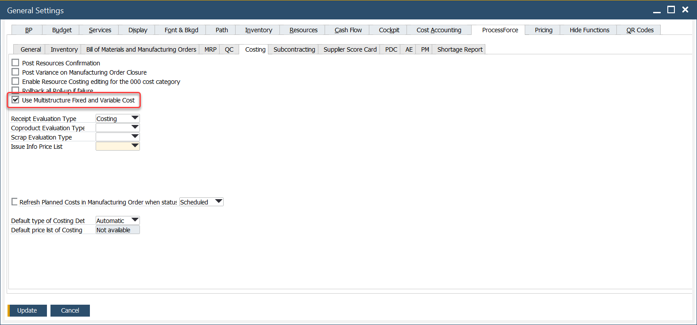
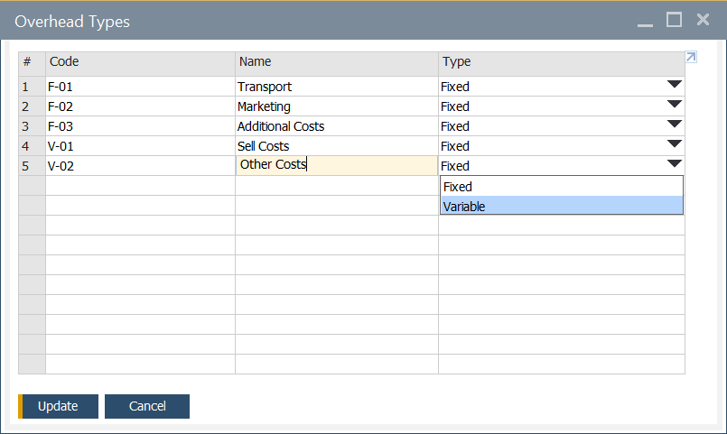
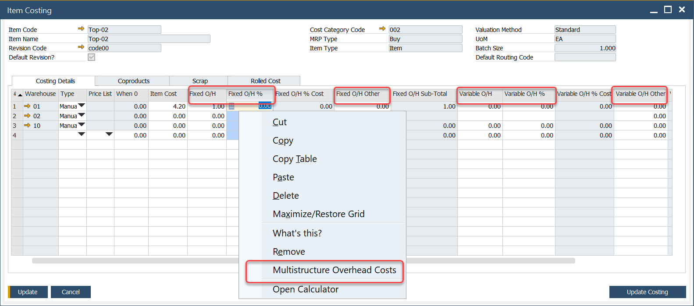
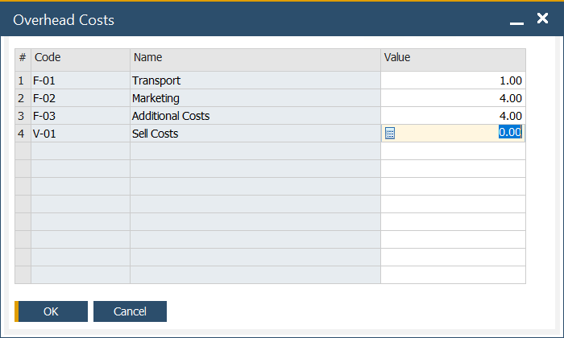
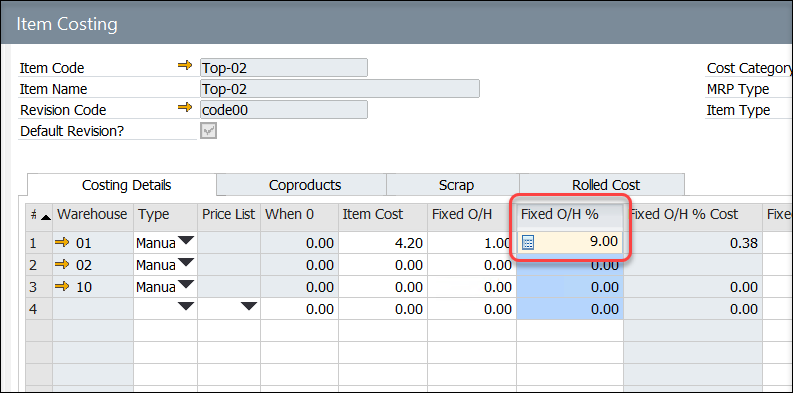

# Multistructure Fixed and Variable Overhead Costs

In ProcessForce, it is possible to define not only simple but also structured Fixed and Variable Overhead costs. This allows us to differentiate the cost and present a sum of it.

## Settings

### General Settings

:::info Path
Administration → System Initialization → General Settings → ProcessForce tab → Costing tab
:::

Multi-structure Fixed and Variable Overhead Costs option is available after checking the check box in the General Settings form, ProcessForce tab, Costing tab:

### Overhead Types definition

:::info Path
Administration → Setup → Financials → Overhead Types
:::

In this form, Costs types can be set. After its definition, Cost types can be used in Item Costing and Resource Costing form. You can define:

- Code,

- Name,

- Type – Fixed or Variable.

## Usage of the option

:::info Path
Costing → Item Costing
:::

Predefined Overhead Types can be used on the Costing Details tab on the Item Costing form and on Resource Costing in the following columns:

- Fixed O/H,

- Fixed O/H %,

- Fixed O/H Other,

- Variable O/H,

- Variable O/H %,

- Variable O/H Other.

After choosing the option, you can select desired costs and set a value for it (only cost marked as fixed are available to choose for fixed costs):

A costs sum will be added to the corresponding grid after clicking the OK button:

Choosing the Multistructure Overhead Costs option again displays previously saved costs and their values and allows one to change them.
