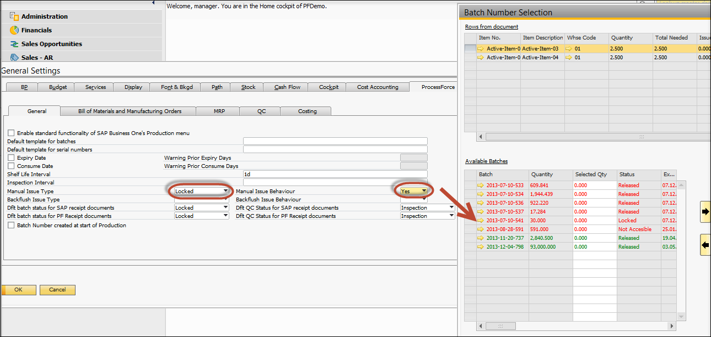
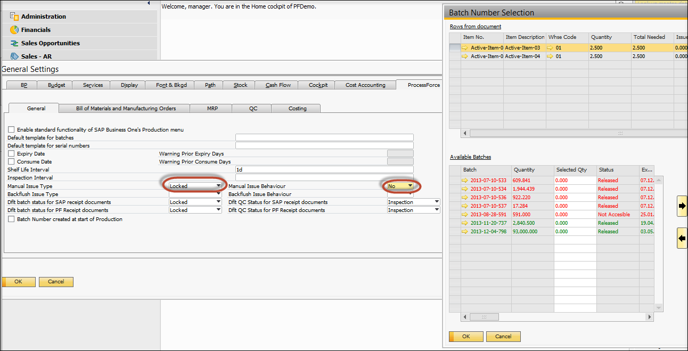
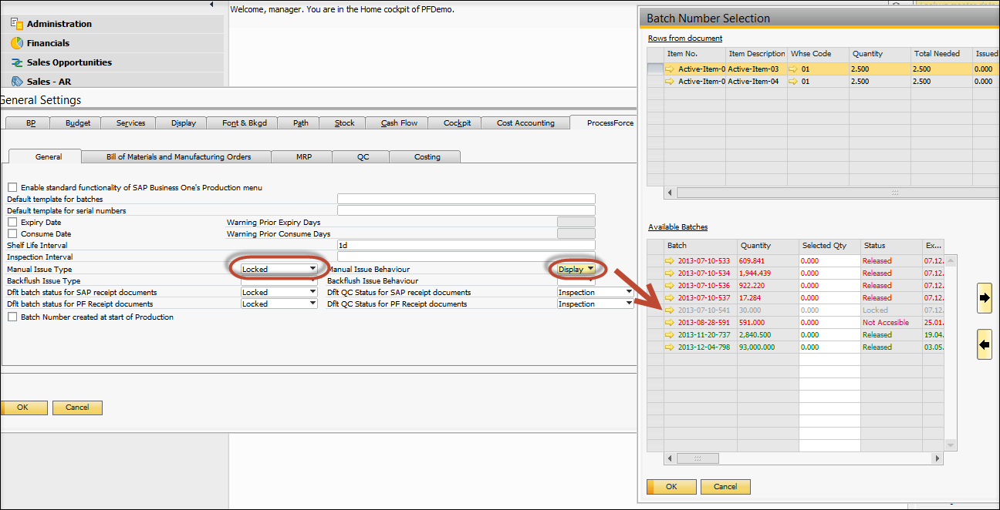
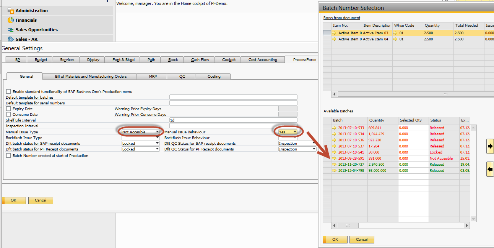
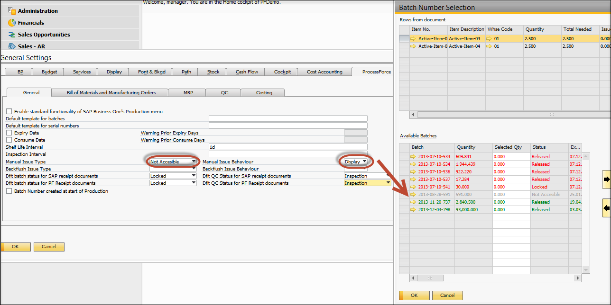
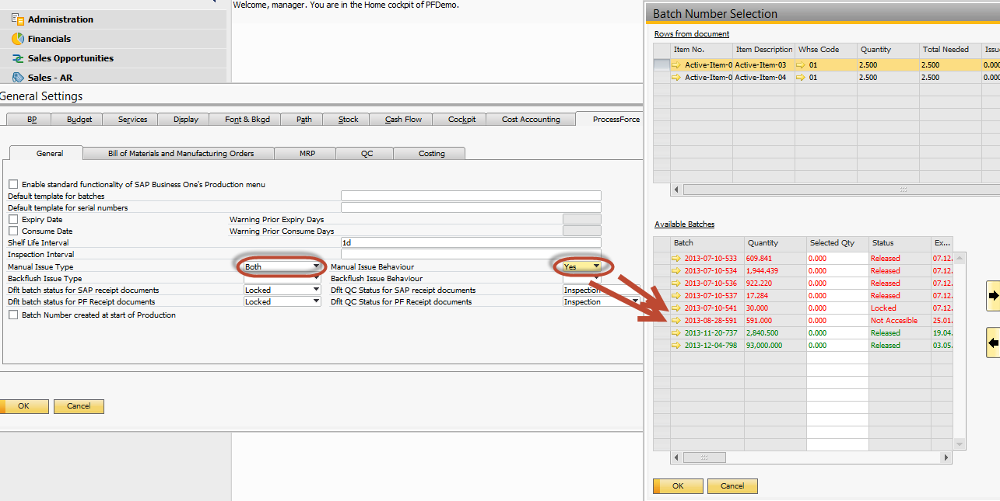
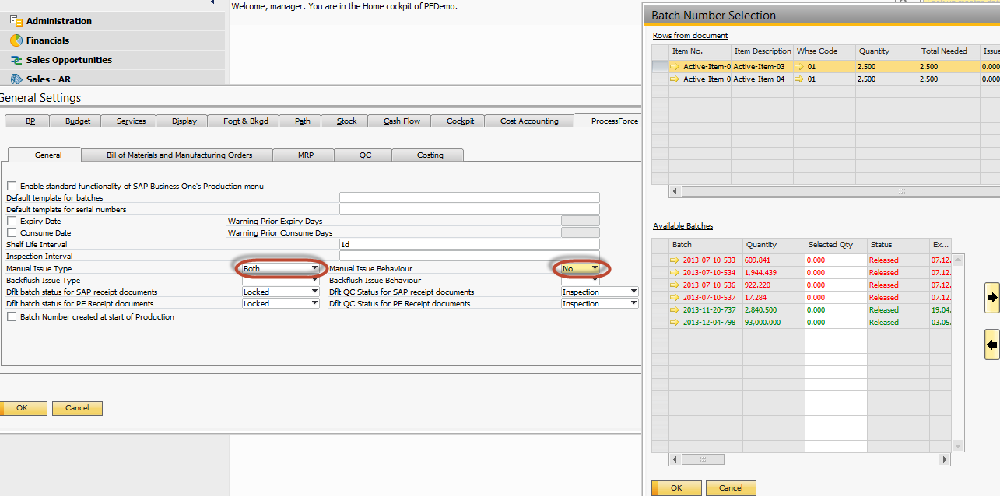
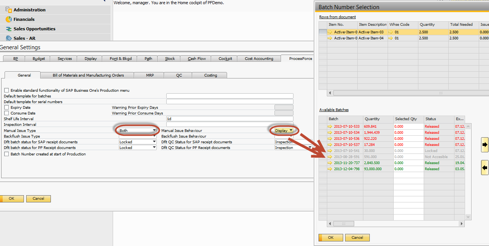

# Manual and Backflush Issue type Configuration

The table below charts the combination between Issue Type and Issue Behavior:

- Yes = the batch is listed within the Batch Number Selection form,

- No =  the batch is not listed within the Batch Number Selection form,

- Display = the batch is displayed and cannot be issued within the Batch Number Selection form.

|   Issue Type   | Issue Behavior |   Issue Behavior   | Issue Behavior |    Issue Behavior    |     Issue Type     |     Issue Type     |
|:--------------:|:--------------:|:------------------:|:--------------:|:--------------------:|:------------------:|:------------------:|
|                |                |                    |                |                      | Not Accessible     | Locked             |
|                |                | Yes                | No             | Display              |                    |                    |
| Locked         | Yes            | :heavy_check_mark: |                |                      | :heavy_check_mark: |                    |
|                | No             |                    |       :x:      |                      | :heavy_check_mark: |                    |
|                | Display        |                    |                | :information_source: | :heavy_check_mark: |                    |
| Non Accessible | Yes            | :heavy_check_mark: |                |                      |                    | :heavy_check_mark: |
|                | No             |                    |       :x:      |                      |                    | :heavy_check_mark: |
|                | Display        |                    |                | :information_source: |                    | :heavy_check_mark: |
| Both           | Yes            | :heavy_check_mark: |                |                      |                    |                    |
|                | No             |                    |       :x:      |                      |                    |                    |
|                | Display        |                    |                | :information_source: |                    |                    |

## Locked – Yes

## Locked – No

## Locked – Display

## Non-Accessible – Yes

## Non-Accessible – No

## Non-Accessible Display

## Both - Yes

## Both - No

## Both - Display

# Backflush Issue Method

The same principles apply to Batches back-flushing.