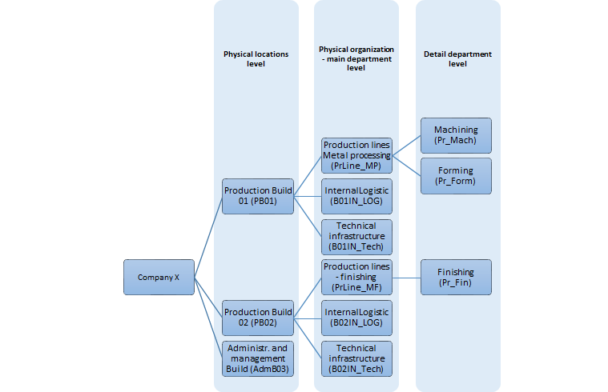

# MI Creation Scenario – Connection to Company Structure and Other Master Data

## Requirement

The user wants to create an MI structure based on the company's physical locations and organization schema. For particular assets, users want to connect to Master Data in other system areas like Departments, Fixed Assets, Resources, and Equipment Cards (Items).
All mentioned Master Data and MI Classes and Categories used in the example must be defined earlier.
Company X – metal processing factory is organized as follows:

|   | Steps                                                                                                               | Actions                                                                                                                                                                                                                                            | Obligatory | Video        |
|---|---------------------------------------------------------------------------------------------------------------------|----------------------------------------------------------------------------------------------------------------------------------------------------------------------------------------------------------------------------------------------------|------------|--------------|
| 1 | Create locations level as Location Type MI's                                                                        | MI Type: Location                                                                                                                                                                                                                                  | Yes        | [Step01](./media/Step01-03.mp4)   |
|   |                                                                                                                     | 'Production Build 01': Class = Buildings, Category = Production, Fixed Asset No. = FA000015                                                                                                                                                        | Yes        |              |
|   |                                                                                                                     | 'Production Build 02': Class = Buildings, Category = Production, Fixed Asset No. = FA000016                                                                                                                                                        | Yes        |              |
|   |                                                                                                                     | 'Administr. and management Build': Class = Buildings, Category = Administration, Fixed Asset No. = FA000017                                                                                                                                        | Yes        |              |
|   |                                                                                                                     | Note 01: to see a list of all MI's with type: 'Location' – go to Find mode, choose to type any other than Location, and then change back to 'Location,' add your additional criteria and press 'Find' button.                                      | Yes        | [Step01-N](./media/Step01_N-03.mp4) |
| 2 | Create organization level as System Type MI's for each building (location)                                          | MI Type: System                                                                                                                                                                                                                                    | Yes        | [Step02](./media/Step02-03.mp4)   |
|   |                                                                                                                     | 'Production lines Metal processing': Class = Organization, Category = Lines, Parent MI Code: PB01(Production Build 01)                                                                                                                             | Yes        |              |
|   |                                                                                                                     | 'Internal Logistic' (PBO1): Class =Organization, Category = Maint., Parent MI Code = PB01(Production Build 01)                                                                                                                                     | Yes        |              |
|   |                                                                                                                     | …                                                                                                                                                                                                                                                  | Yes        |              |
| 3 | Create a detail department level as Position Type MI's                                                              | MI Type: Position                                                                                                                                                                                                                                  | Yes        | [Step03](./media/Step03-03.mp4)   |
|   |                                                                                                                     | 'Machining': Parent MI Code = PrLine_MP (Production lines Metal processing), Department = PRMA (Production-Machining)                                                                                                                              | Yes        |              |
|   |                                                                                                                     | 'Forming': Parent MI Code = PrLine_MS (Production lines Metal processing), Department = PRFO (Production-Forming)                                                                                                                                  | Yes        |              |
|   |                                                                                                                     | 'Finishing': Parent MI Code = PrLine_MF (Production lines - finishing), Department = PRFN (Production-Finishing)                                                                                                                                   | Yes        |              |
|   |                                                                                                                     | Note 02: to create a new MI's with similar data we can use the option 'Duplicate' instead of 'Add'.                                                                                                                                                | Yes        |              |
| 4 | Create assets which are created as Resources (machines, production stations, etc.)                                  | MI Type: Asset Assigned Obj.=Yes (Resource)                                                                                                                                                                                                        | Yes        | [Step04](./media/Step04-03.mp4)   |
|   |                                                                                                                     | 'Lathe BERNARDO FTR980': Class = Machinery, Category = Lathes, Parent MI Code = Pr_Mach (Machining), Resource=M03 (Lathe BERNARDO), Department = PRMA (Production-Machining), Fixed Asset No. = FA000003                                           | Yes        |              |
|   |                                                                                                                     | …                                                                                                                                                                                                                                                  | Yes        |              |
| 5 | Create assets which are not Resources but are serialized Items (tools, specialist equipment, devices, meters)       | MI Type: Asset Assigned Obj.=Yes (Item)                                                                                                                                                                                                            | Yes        | [Step05](./media/Step05-03.mp4)   |
|   |                                                                                                                     | 'Controller - saw line': Class = Tools, Category = Mach_Equipment, Parent MI Code = MI00004 (CNC Band Saw...),  Item = I000001, Apparatus Type = Tool, Equipment Card= S00001 Department = PRMA (Production-Machining), Fixed Asset No. = FA000014 | Yes        |              |
|   |                                                                                                                     | …                                                                                                                                                                                                                                                  | Yes        |              |
| 6 | Create assets not defined as Resources or serialized Items but are fixed assets (forklifts, air conditioners, etc.) | MI Type: Asset Assigned Obj.=Yes (Fixed Asset)                                                                                                                                                                                                     | Yes        | [Step06](./media/Step06-03.mp4)   |
|   |                                                                                                                     | 'Forklift 1': Class = Transport, Category = Forklifts, Parent MI Code = B01IN_LOG (B01 Internal Logistic),  Fixed Asset No. = FA000008, Department = PRMA (Production-Machining), Fixed Asset No. = FA000008                                       | Yes        |              |
|   |                                                                                                                     | …                                                                                                                                                                                                                                                  | Yes        |              |