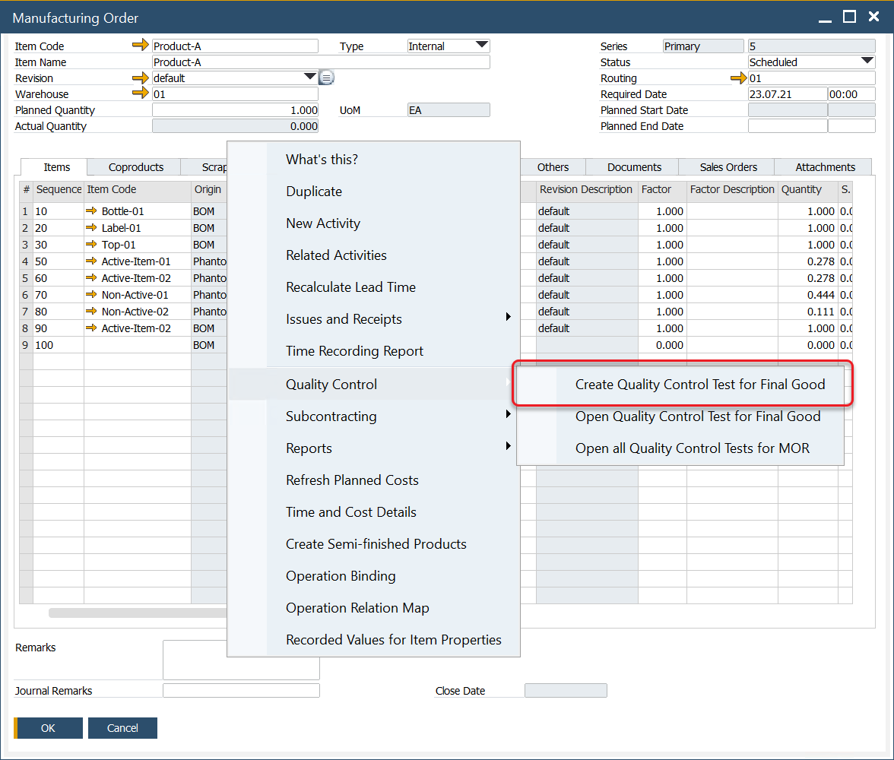
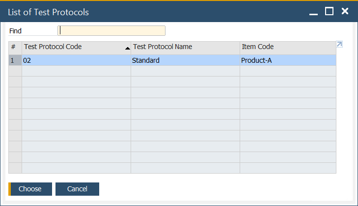
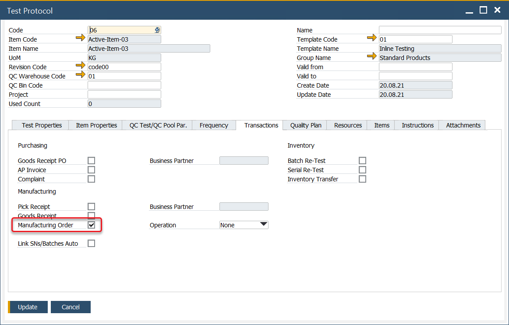
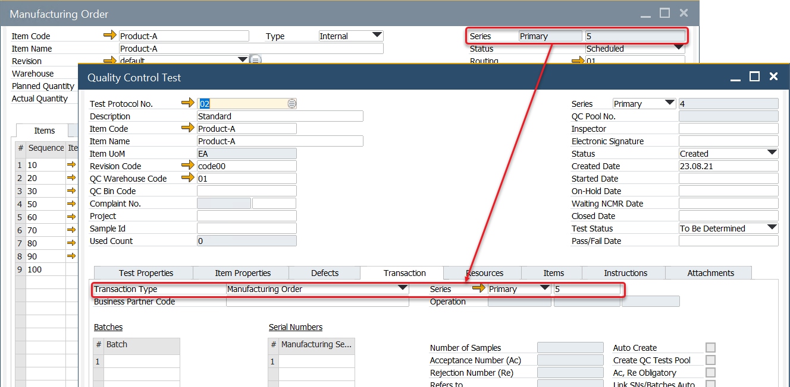
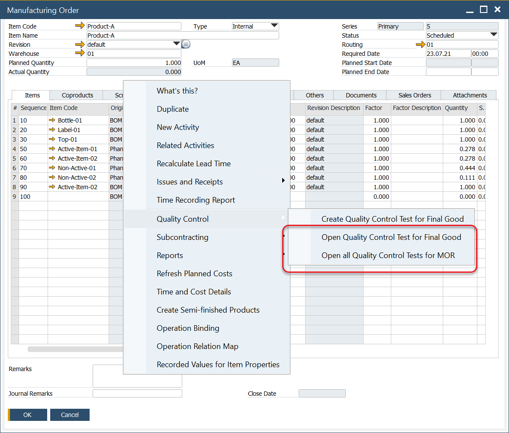
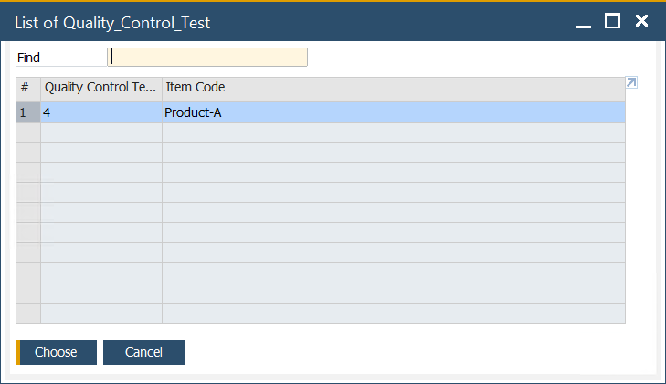

# Quality Control Tests from a Manufacturing Order

You can create a Quality Control Test from the Manufacturing Order context menu. From this place, you can also display a list of already created QC Tests.

---

## Creating a Quality Control Test from a Manufacturing Order

Select Create Quality Control Test option from a context menu on the Manufacturing Order form:

A list of Protocols will be displayed:

Select one and click Choose.
Note that Test Protocol with corresponding data and Manufacturing Order check box checked must be created to be available on this list. Click here to check how to create a Test Protocol.

A Quality Control Test will be created with corresponding data. Click Add button to post it.

## View Existing Quality Control Tests

You can open Quality Control Test for a Final Good or a whole Manufacturing Order:

A list of tests will be displayed:

