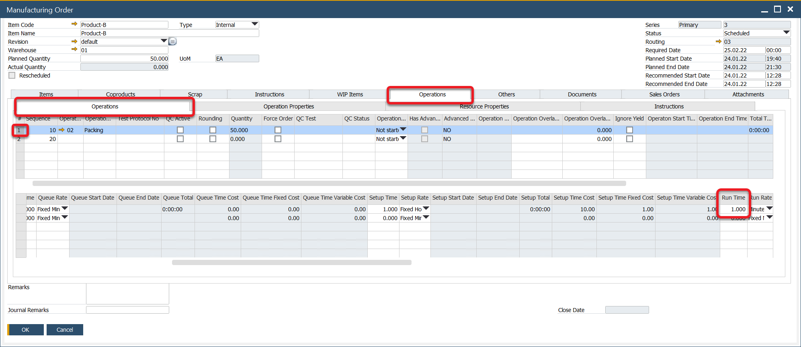
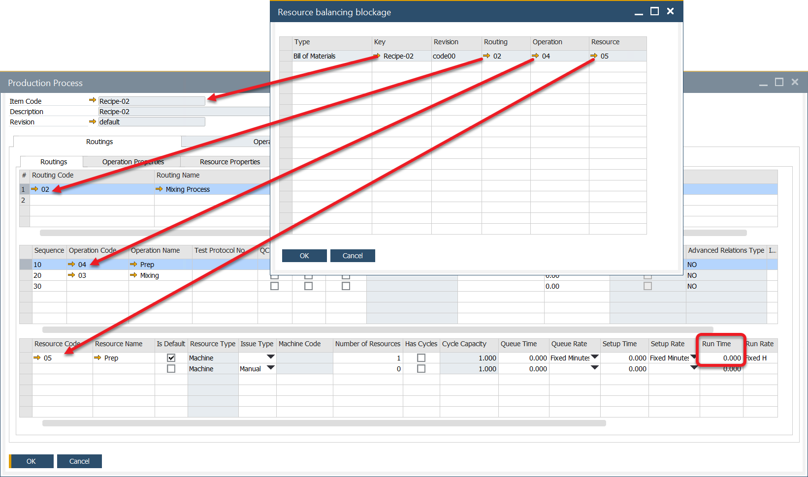

# Resource Balancing

This option allows choosing the most optimal Resource (defined in Production Process / Manufacturing Order **ADD LINK** Alternative Resources) for a specific task from a Manufacturing Order.

:::danger
Testing the option in a test environment before using it in a production environment is recommended.
:::

## Description

The system considers related times, Operation quantities, Resource availability, and Resource Calendars and chooses the Resource on which work can be completed in the shortest time (instead of selecting a default Resource).

### Example

Quantity on Manufacturing Order: 100

Bill of Materials' Resources on Operation:

    M1 10pcs/h

    M2 10 pcs/h

    M3 5 pcs/h

    M4 5 pcs/h

    M5 10 pcs /h

Scheduling Direction: Forward (from date 01/01)

(all machines work 24/7)

    M1 needs ten h to run and is available from 10.01 to 10 a.m. Therefore, it would finish the work on 10.01 at 8 p.m.

    M2 needs ten h to run and is available from 11.01 to 5 p.m. Consequently, it would finish this work on 12.01 at 3 a.m.

    **M3 needs 20 h to run and is available from 9.01 to 1 a.m. Consequently, it would finish this work on 9.01 at 9 p.m.**

    M4 needs 20 h to run and is available from 10.01 to 5 a.m. and would finish this work on 10.01 at 1 a.m.

    M5 needs ten h to run and is available from 10.01 to 7 p.m. and would finish this work on 11.01 at 5 a.m.


**The system will choose M3 for this work**

## Prerequisites

### Run Time

To use this option, it is required Run Time to be greater than 0 for all Resources used in Production Processes and Manufacturing Orders in the system:

Production Process:


Manufacturing Order:



### General Settings option

:::info Path
Administration → System Initialization → General Settings → ProcessForce tab → Bill of Materials and Manufacturing Orders
:::

Check the Use Resource Balancing check box to use the option.

#### Resource balancing blockage

Suppose any Machine type Resource in the system has Run Time set to zero in any Production Process configuration. In that case, the Resource balancing blockage form is displayed upon attempts to check the Use Resource Balancing checkbox. The form holds information pointing to these Resources. Change their Run Time to activate the option.



## Usage

When the option is checked, the Resource choosing based on Resource Balancing is performed during Manufacturing Order scheduling or re-scheduling, which occurs in the following situations:

- on opening the Scheduling Board / Semi-finished Product Scheduling form,

- By changing the Planned Quantity or Manufacturing Order header's dates.

## Log files

A function for saving action logs to files is available specifically for the Resource Balancing function.

:::warning
Please remember that this function logs detailed information on every scheduling/rescheduling action regarding Resource Balancing. Therefore it might affect ProccessForce's performance.
:::

To activate the option perform the following steps:

1. Go to the following path: C:\Program Files\sap\SAP Business One\AddOns\CT\ProcessForce.

2. Open ProcessForce.exe.config file with a text editor.

3. Change the value from "false" to "true" in the following line:

    ```
    <add key="SchedulingBalancingEnabled" value="false" />
    ```
    From now on, the log files will be saved in the following path: default path: C:\ProgramData\CompuTec\ProcessForce\ResourceBalancing.

    A separate file is saved for changes made for each Operation.