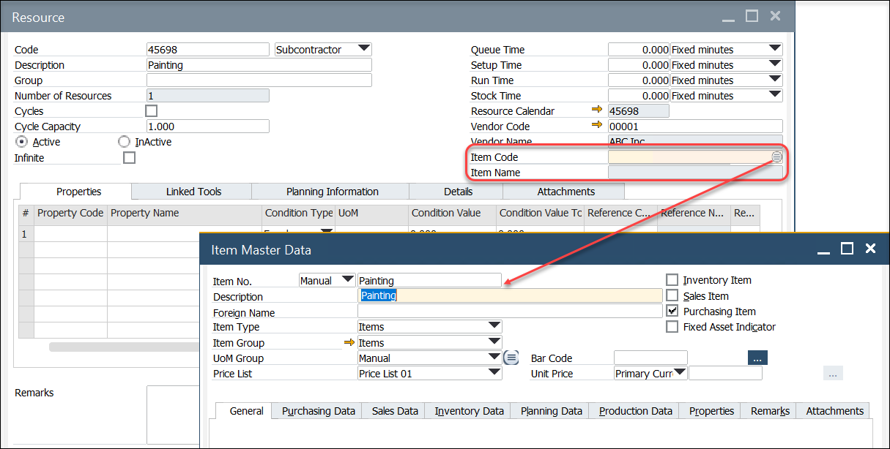
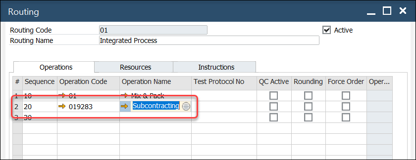

# Subcontractor Type Resource

## Overview

Subcontracting can be taken into the production process by creating subcontractor-type Resources, adding to Operation, and adding Operation to Routing.

## Resources

A resource type may be set as a Subcontractor for a service performed by an external organization. 

- Select the resource type Subcontractor. After a selection, several additional fields are displayed.

- Select the supplier performing the service (Vendor Code and Vendor Name fields),

- Select the item (defined as a non-inventory item and purchased).

- As per resources, define the operation (like here), and add the process to the route:

